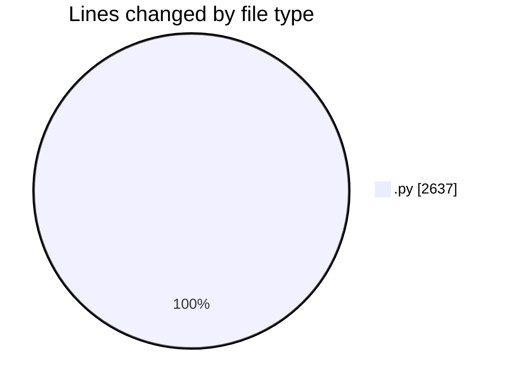
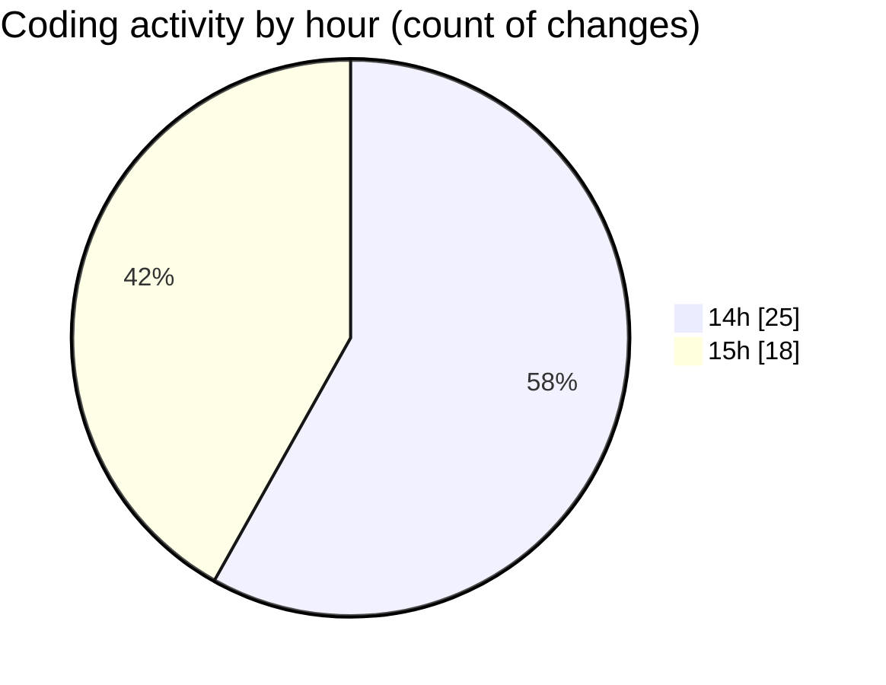

# AI_Assignment - Activity Summary 

## Overall Statistics

| Stat                   | Value                                                             |
| ---------------------- | ----------------------------------------------------------------- |
| **Lines Added** (➕)   | 2637                                          |
| **Lines Removed** (➖) | 0                                        |
| **Net Change** (↕)    | 2637                |
| **Active Time** (⌚)   | 42 minutes |

## Modified Files
- **config.py** (+67, -0)
- **dijkstra.py** (+359, -0)
- **astar.py** (+338, -0)
- **grid.py** (+292, -0)
- **obstacle_generator.py** (+347, -0)
- **ugv.py** (+312, -0)
- **dynamic_replanning.py** (+395, -0)
- **visualization.py** (+375, -0)
- **test_dijkstra.py** (+152, -0)

## Visualizations

### By File Type (Lines Changed)

### By Hour (Estimated Activity Count)

> **Last Updated:** 3/14/2026, 3:02:39 PM