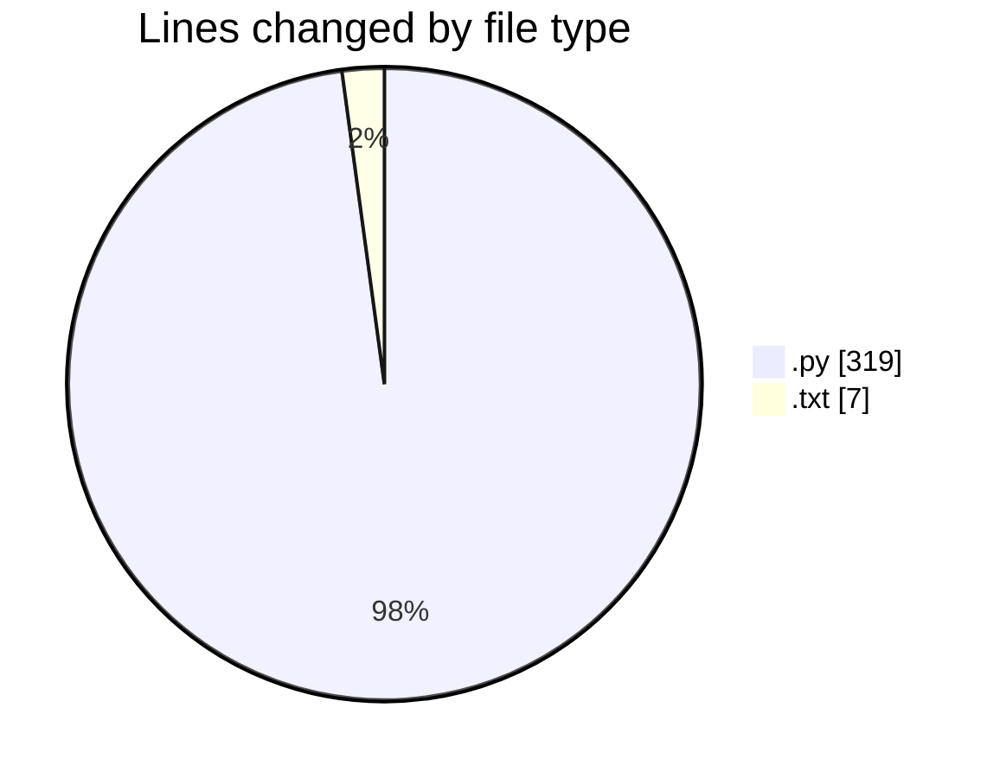
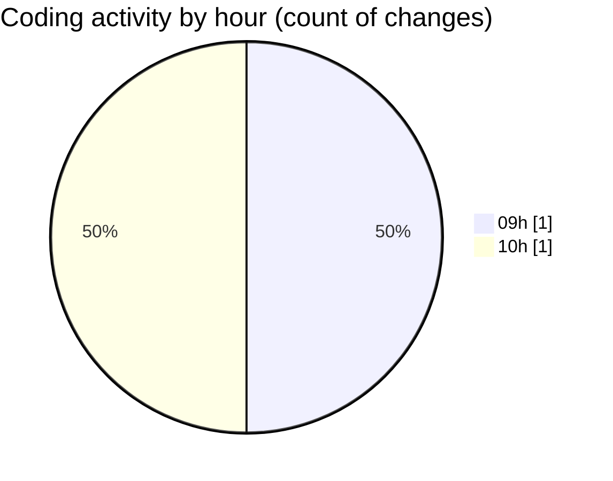

# Assignment 1 - Activity Summary 

## Overall Statistics

| Stat                   | Value                                                             |
| ---------------------- | ----------------------------------------------------------------- |
| **Lines Added** (➕)   | 326                                          |
| **Lines Removed** (➖) | 0                                        |
| **Net Change** (↕)    | 326                |
| **Active Time** (⌚)   | 0 minute |

## Modified Files
- **ecommerce_system.py** (+319, -0)
- **orders_report.txt** (+7, -0)

## Visualizations

### By File Type (Lines Changed)

### By Hour (Estimated Activity Count)

> **Last Updated:** 3/21/2026, 10:10:35 AM