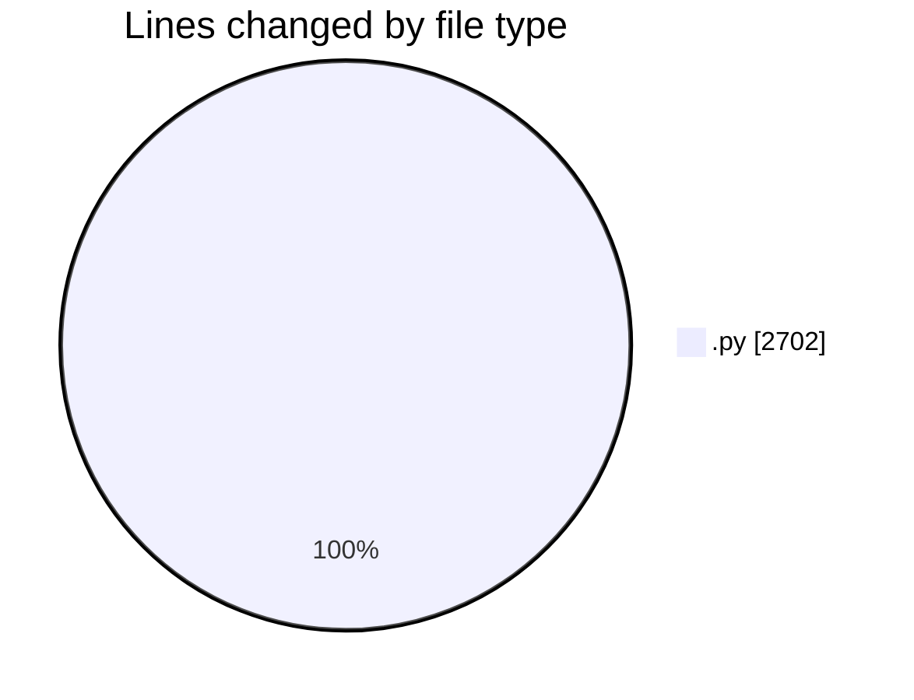
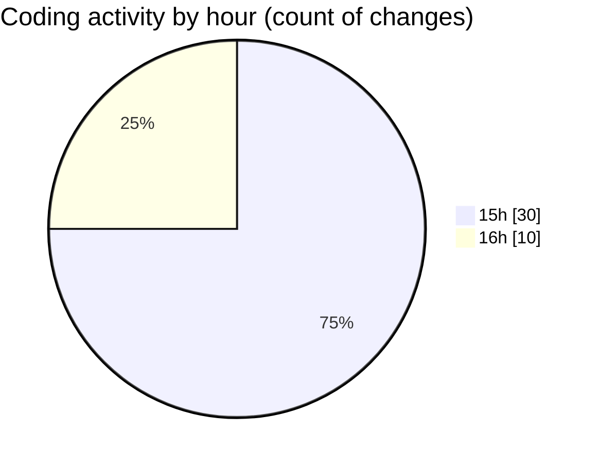

# AI-Programming-Assignment-4 - Activity Summary 

## Overall Statistics

| Stat                   | Value                                                             |
| ---------------------- | ----------------------------------------------------------------- |
| **Lines Added** (➕)   | 2700                                          |
| **Lines Removed** (➖) | 2                                        |
| **Net Change** (↕)    | 2698                |
| **Active Time** (⌚)   | 43 minutes |

## Modified Files
- **csp.py** (+248, -0)
- **heuristics.py** (+74, -0)
- **map_coloring_australia.py** (+124, -0)
- **map_coloring_telangana.py** (+186, -0)
- **sudoku_solver.py** (+241, -0)
- **cryptarithmetic.py** (+306, -2)
- **visualization.py** (+229, -0)
- **test_all_csp.py** (+242, -0)
- **main.py** (+165, -0)
- **sample_inputs.py** (+398, -0)
- **quick_test.py** (+101, -0)
- **simple_csp.py** (+50, -0)
- **simple_australia.py** (+54, -0)
- **simple_telangana.py** (+65, -0)
- **simple_sudoku.py** (+121, -0)
- **simple_cryptarithmetic.py** (+96, -0)

## Visualizations

### By File Type (Lines Changed)

### By Hour (Estimated Activity Count)

> **Last Updated:** 4/2/2026, 4:08:49 PM