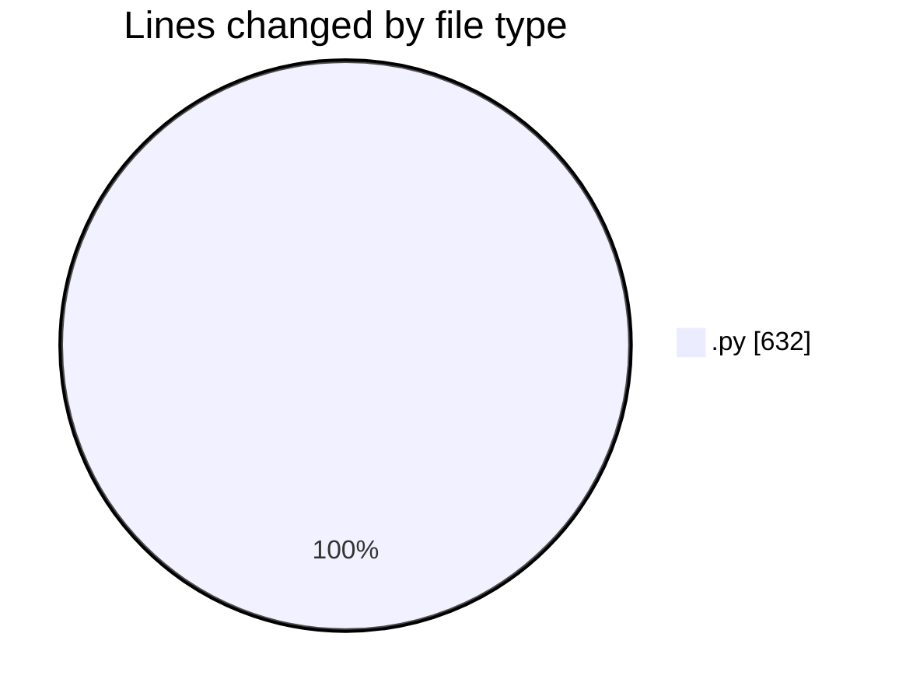
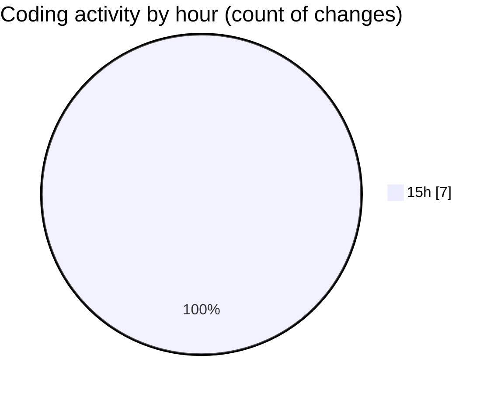

# AI-Programming-Assignment-4 - Activity Summary 

## Overall Statistics

| Stat                   | Value                                                             |
| ---------------------- | ----------------------------------------------------------------- |
| **Lines Added** (➕)   | 632                                          |
| **Lines Removed** (➖) | 0                                        |
| **Net Change** (↕)    | 632                |
| **Active Time** (⌚)   | 6 minutes |

## Modified Files
- **csp.py** (+248, -0)
- **heuristics.py** (+74, -0)
- **map_coloring_australia.py** (+124, -0)
- **map_coloring_telangana.py** (+186, -0)

## Visualizations

### By File Type (Lines Changed)

### By Hour (Estimated Activity Count)

> **Last Updated:** 4/2/2026, 3:38:49 PM