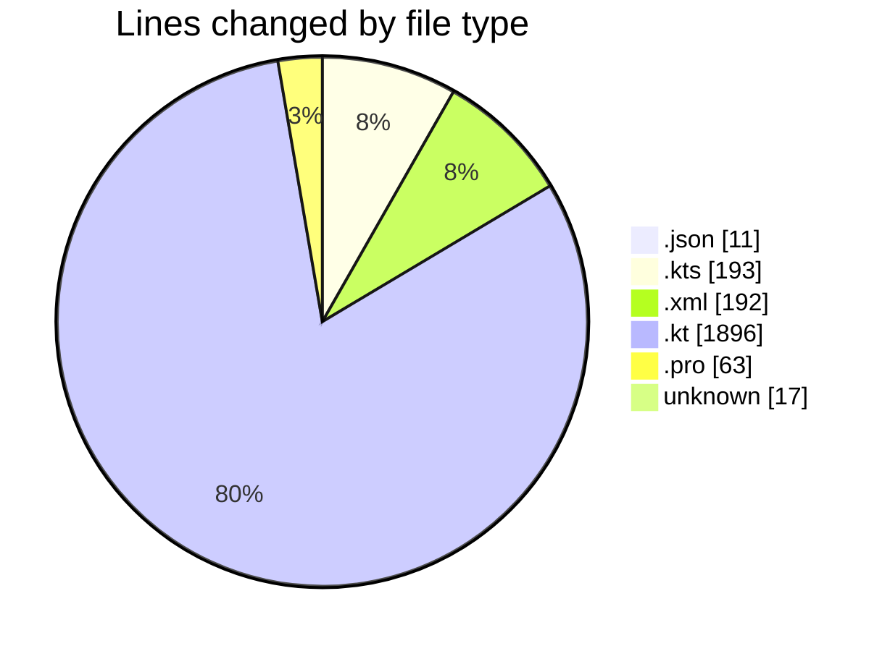
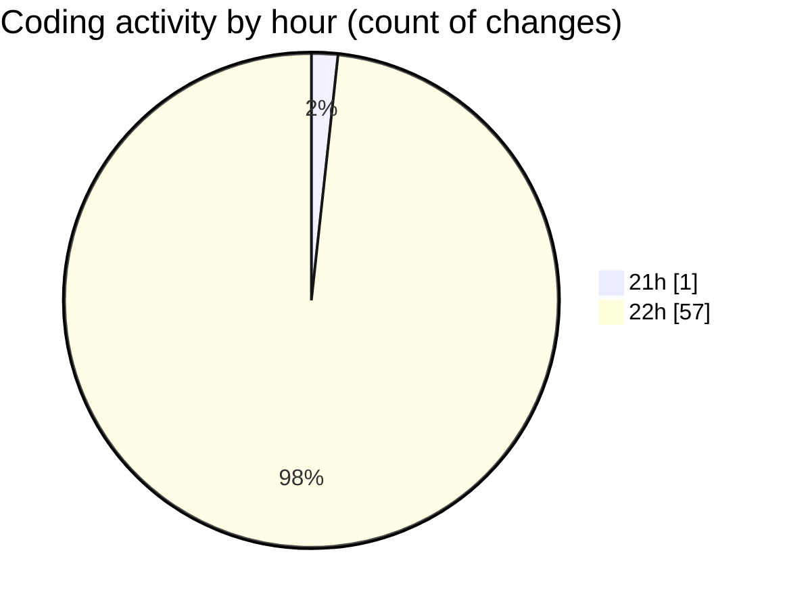

# T2S - Activity Summary 

## Overall Statistics

| Stat                   | Value                                                             |
| ---------------------- | ----------------------------------------------------------------- |
| **Lines Added** (➕)   | 2372                                          |
| **Lines Removed** (➖) | 0                                        |
| **Net Change** (↕)    | 2372                |
| **Active Time** (⌚)   | 55 minutes |

## Modified Files
- **chatLanguageModels.json** (+11, -0)
- **build.gradle.kts** (+11, -0)
- **settings.gradle.kts** (+20, -0)
- **build.gradle.kts** (+162, -0)
- **AndroidManifest.xml** (+110, -0)
- **T2SApplication.kt** (+20, -0)
- **ITextToSpeechService.kt** (+140, -0)
- **ITranslationService.kt** (+61, -0)
- **IFileService.kt** (+106, -0)
- **IBrowserService.kt** (+69, -0)
- **IPlaybackManager.kt** (+94, -0)
- **AppModule.kt** (+98, -0)
- **Theme.kt** (+70, -0)
- **Type.kt** (+121, -0)
- **BaseViewModel.kt** (+44, -0)
- **T2SDatabase.kt** (+25, -0)
- **Converters.kt** (+24, -0)
- **Entities.kt** (+37, -0)
- **Dao.kt** (+62, -0)
- **MainActivity.kt** (+56, -0)
- **TextToSpeechServiceImpl.kt** (+180, -0)
- **TranslationServiceImpl.kt** (+56, -0)
- **FileServiceImpl.kt** (+69, -0)
- **BrowserServiceImpl.kt** (+62, -0)
- **PlaybackManagerImpl.kt** (+82, -0)
- **HomeScreen.kt** (+132, -0)
- **SelectToSpeakService.kt** (+32, -0)
- **ClipboardReceiver.kt** (+18, -0)
- **T2SContentProvider.kt** (+35, -0)
- **AudioPlaybackForegroundService.kt** (+65, -0)
- **strings.xml** (+52, -0)
- **proguard-rules.pro** (+63, -0)
- **dimens.xml** (+30, -0)
- **.gitignore** (+17, -0)
- **TTSServiceTest.kt** (+42, -0)
- **TranslationServiceTest.kt** (+42, -0)
- **FileServiceTest.kt** (+54, -0)

## Visualizations

### By File Type (Lines Changed)

### By Hour (Estimated Activity Count)

> **Last Updated:** 4/7/2026, 10:10:05 PM