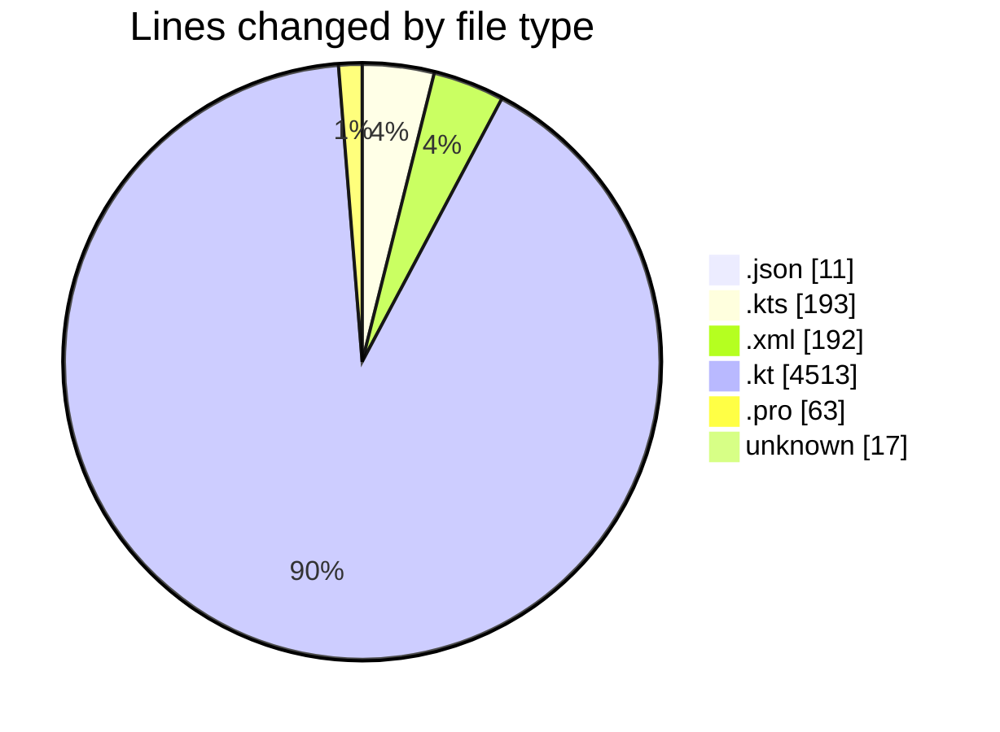
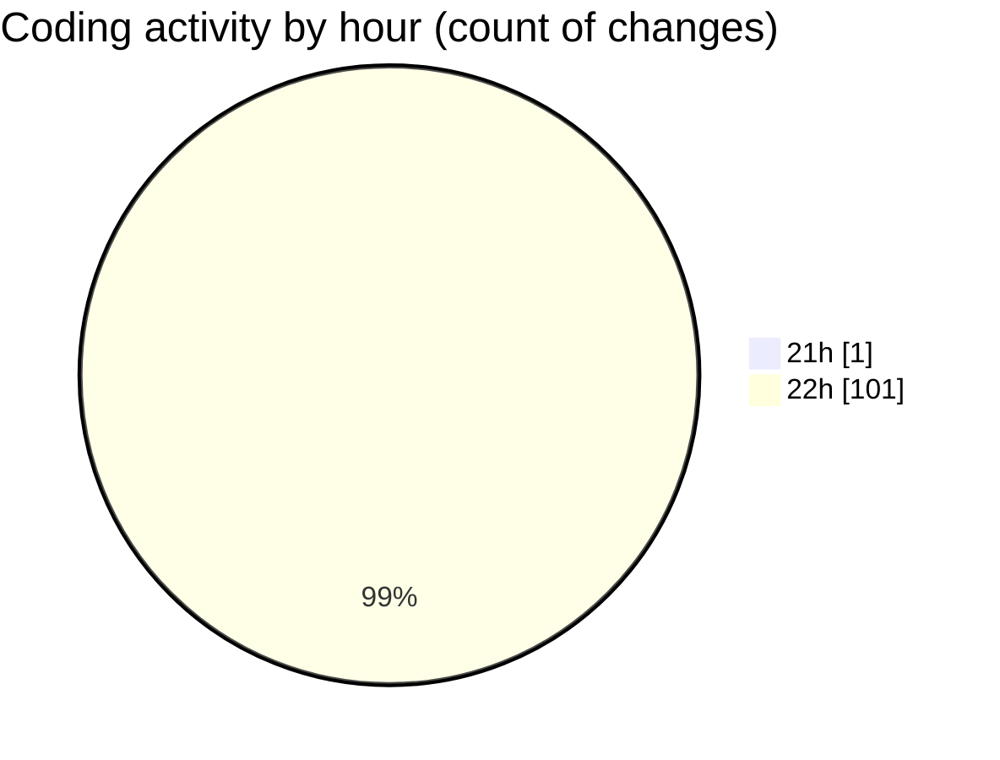

# T2S - Activity Summary 

## Overall Statistics

| Stat                   | Value                                                             |
| ---------------------- | ----------------------------------------------------------------- |
| **Lines Added** (➕)   | 4989                                          |
| **Lines Removed** (➖) | 0                                        |
| **Net Change** (↕)    | 4989                |
| **Active Time** (⌚)   | 101 minutes |

## Modified Files
- **chatLanguageModels.json** (+11, -0)
- **build.gradle.kts** (+11, -0)
- **settings.gradle.kts** (+20, -0)
- **build.gradle.kts** (+162, -0)
- **AndroidManifest.xml** (+110, -0)
- **T2SApplication.kt** (+20, -0)
- **ITextToSpeechService.kt** (+140, -0)
- **ITranslationService.kt** (+61, -0)
- **IFileService.kt** (+106, -0)
- **IBrowserService.kt** (+69, -0)
- **IPlaybackManager.kt** (+94, -0)
- **AppModule.kt** (+157, -0)
- **Theme.kt** (+70, -0)
- **Type.kt** (+121, -0)
- **BaseViewModel.kt** (+44, -0)
- **T2SDatabase.kt** (+25, -0)
- **Converters.kt** (+24, -0)
- **Entities.kt** (+37, -0)
- **Dao.kt** (+62, -0)
- **MainActivity.kt** (+56, -0)
- **TextToSpeechServiceImpl.kt** (+262, -0)
- **TranslationServiceImpl.kt** (+224, -0)
- **FileServiceImpl.kt** (+69, -0)
- **BrowserServiceImpl.kt** (+62, -0)
- **PlaybackManagerImpl.kt** (+82, -0)
- **HomeScreen.kt** (+132, -0)
- **SelectToSpeakService.kt** (+32, -0)
- **ClipboardReceiver.kt** (+18, -0)
- **T2SContentProvider.kt** (+35, -0)
- **AudioPlaybackForegroundService.kt** (+65, -0)
- **strings.xml** (+52, -0)
- **proguard-rules.pro** (+63, -0)
- **dimens.xml** (+30, -0)
- **.gitignore** (+17, -0)
- **TTSServiceTest.kt** (+42, -0)
- **TranslationServiceTest.kt** (+42, -0)
- **FileServiceTest.kt** (+54, -0)
- **TextToSpeechServiceImplTest.kt** (+142, -0)
- **TranslationServiceImplTest.kt** (+72, -0)
- **FileServiceImplTest.kt** (+92, -0)
- **BrowserServiceImplTest.kt** (+102, -0)
- **PlaybackManagerImplTest.kt** (+131, -0)
- **BookmarkDaoTest.kt** (+116, -0)
- **ReadingPositionDaoTest.kt** (+121, -0)
- **TranslationCacheDaoTest.kt** (+143, -0)
- **PlaybackControls.kt** (+58, -0)
- **HomeScreenTest.kt** (+123, -0)
- **PlaybackControlsTest.kt** (+120, -0)
- **FileToSpeechIntegrationTest.kt** (+66, -0)
- **BrowserToSpeechIntegrationTest.kt** (+88, -0)
- **CoroutineTestRule.kt** (+29, -0)
- **TestFixtures.kt** (+83, -0)
- **DatabaseInitializationTest.kt** (+57, -0)
- **EntitySerializationTest.kt** (+60, -0)
- **MyMemoryTranslationResponse.kt** (+46, -0)
- **MyMemoryApiService.kt** (+22, -0)
- **GoogleTranslateApiService.kt** (+32, -0)
- **TranslationServiceImplIntegrationTest.kt** (+96, -0)
- **TextToSpeechServiceEndToEndTest.kt** (+136, -0)
- **MyMemoryApiServiceTest.kt** (+164, -0)
- **Phase2IntegrationTest.kt** (+209, -0)

## Visualizations

### By File Type (Lines Changed)

### By Hour (Estimated Activity Count)

> **Last Updated:** 4/7/2026, 11:00:05 PM