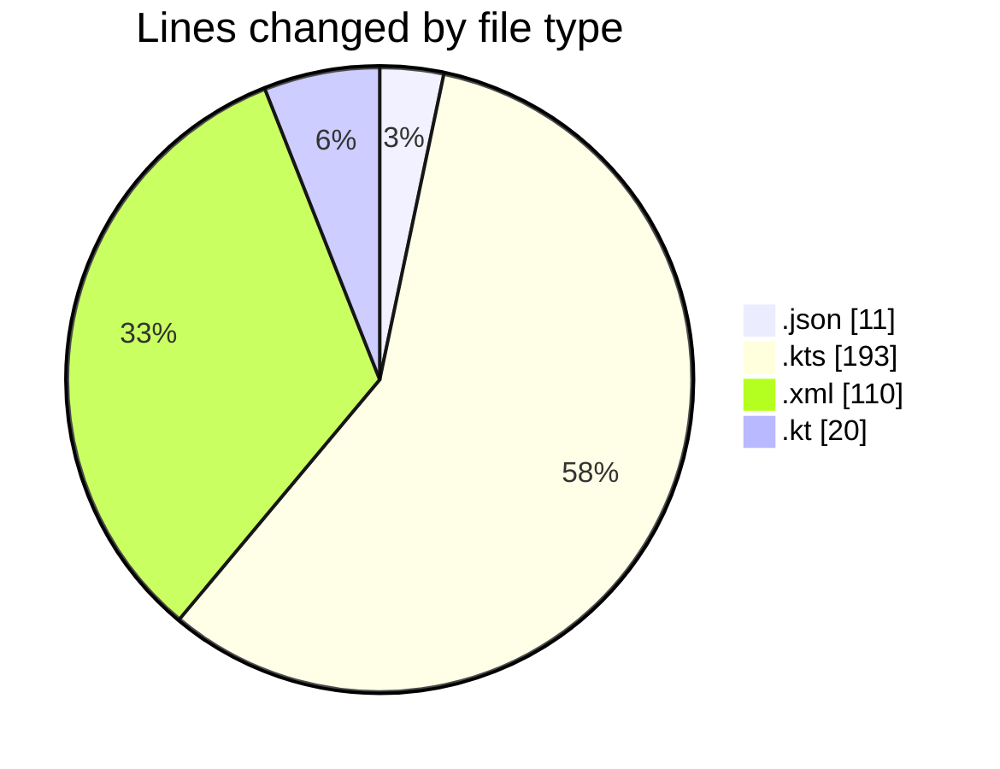
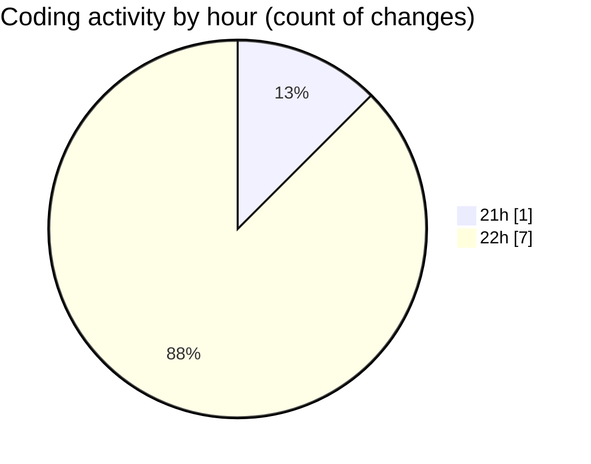

# T2S - Activity Summary 

## Overall Statistics

| Stat                   | Value                                                             |
| ---------------------- | ----------------------------------------------------------------- |
| **Lines Added** (➕)   | 334                                          |
| **Lines Removed** (➖) | 0                                        |
| **Net Change** (↕)    | 334                |
| **Active Time** (⌚)   | 5 minutes |

## Modified Files
- **chatLanguageModels.json** (+11, -0)
- **build.gradle.kts** (+11, -0)
- **settings.gradle.kts** (+20, -0)
- **build.gradle.kts** (+162, -0)
- **AndroidManifest.xml** (+110, -0)
- **T2SApplication.kt** (+20, -0)

## Visualizations

### By File Type (Lines Changed)

### By Hour (Estimated Activity Count)

> **Last Updated:** 4/7/2026, 10:05:05 PM