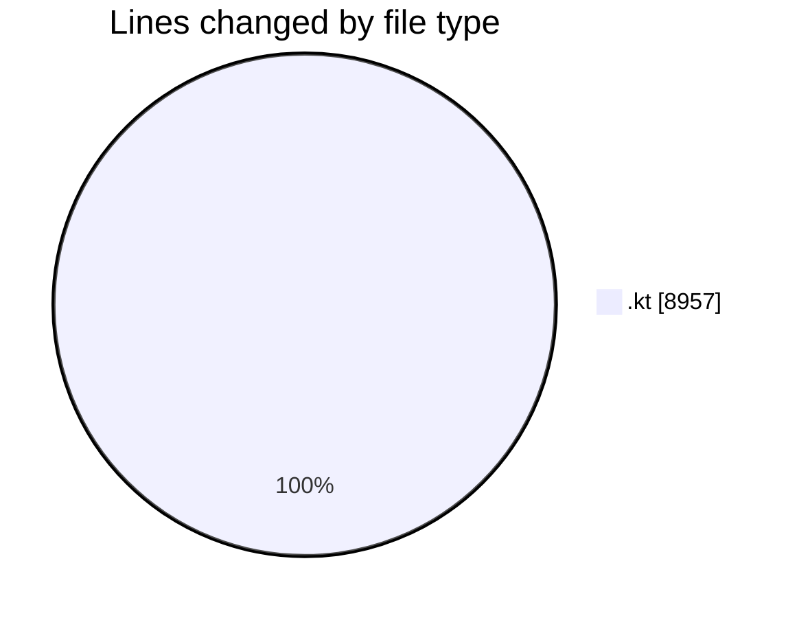
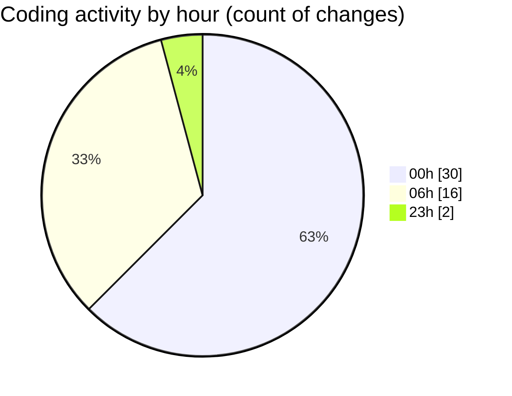

# T2S - Activity Summary 

## Overall Statistics

| Stat                   | Value                                                             |
| ---------------------- | ----------------------------------------------------------------- |
| **Lines Added** (➕)   | 8957                                          |
| **Lines Removed** (➖) | 0                                        |
| **Net Change** (↕)    | 8957                |
| **Active Time** (⌚)   | 55 minutes |

## Modified Files
- **PlaybackStatusTest.kt** (+477, -0)
- **SettingsModels.kt** (+231, -0)
- **SettingsRepositoryImpl.kt** (+205, -0)
- **AppSettingsViewModel.kt** (+328, -0)
- **SettingsScreen.kt** (+534, -0)
- **PlaybackControls.kt** (+437, -0)
- **SettingsRepositoryTest.kt** (+482, -0)
- **AppSettingsViewModelTest.kt** (+360, -0)
- **PlaybackControlsUITest.kt** (+380, -0)
- **SettingsScreenUITest.kt** (+440, -0)
- **SettingsIntegrationTest.kt** (+385, -0)
- **BrowserViewScreen.kt** (+394, -0)
- **BrowserViewModel.kt** (+285, -0)
- **BrowserViewModelTest.kt** (+421, -0)
- **BrowserViewScreenUITest.kt** (+423, -0)
- **BrowserIntegrationTest.kt** (+491, -0)
- **ExportModels.kt** (+209, -0)
- **AudioExportServiceImpl.kt** (+300, -0)
- **ExportViewModel.kt** (+298, -0)
- **ExportScreen.kt** (+518, -0)
- **AudioExportServiceTest.kt** (+342, -0)
- **ExportViewModelTest.kt** (+367, -0)
- **ExportScreenUITest.kt** (+285, -0)
- **ExportIntegrationTest.kt** (+365, -0)

## Visualizations

### By File Type (Lines Changed)

### By Hour (Estimated Activity Count)

> **Last Updated:** 4/8/2026, 6:20:44 AM