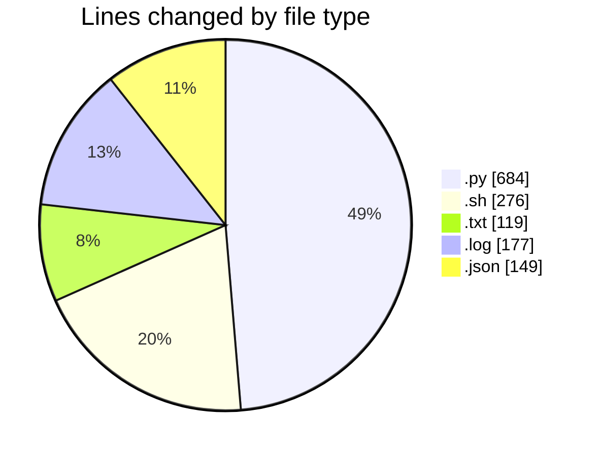
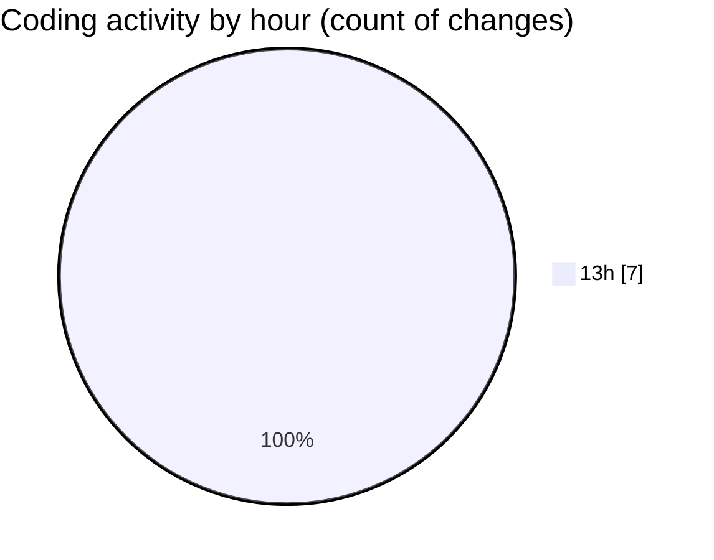

# Scripting workshop - Activity Summary 

## Overall Statistics

| Stat                   | Value                                                             |
| ---------------------- | ----------------------------------------------------------------- |
| **Lines Added** (➕)   | 1405                                          |
| **Lines Removed** (➖) | 0                                        |
| **Net Change** (↕)    | 1405                |
| **Active Time** (⌚)   | 6 minutes |

## Modified Files
- **automation_system.py** (+684, -0)
- **system_automation.sh** (+276, -0)
- **crontab_setup.txt** (+119, -0)
- **system_monitoring_output_day1.log** (+61, -0)
- **system_monitoring_output_day2.log** (+57, -0)
- **system_monitoring_output_day3.log** (+59, -0)
- **sample_report.json** (+149, -0)

## Visualizations

### By File Type (Lines Changed)

### By Hour (Estimated Activity Count)

> **Last Updated:** 4/11/2026, 1:19:42 PM