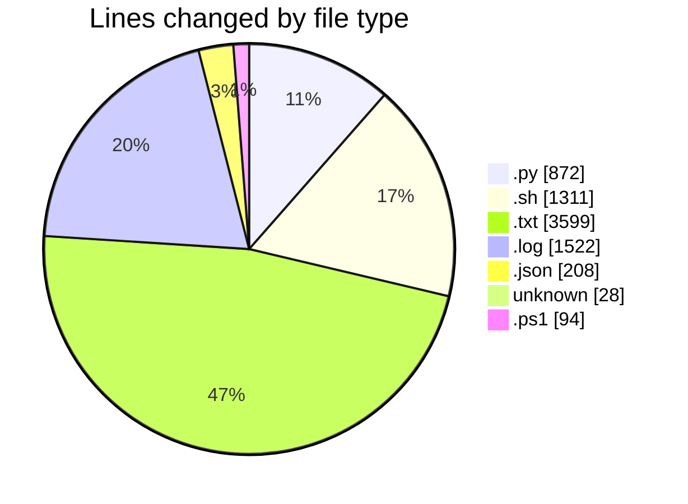
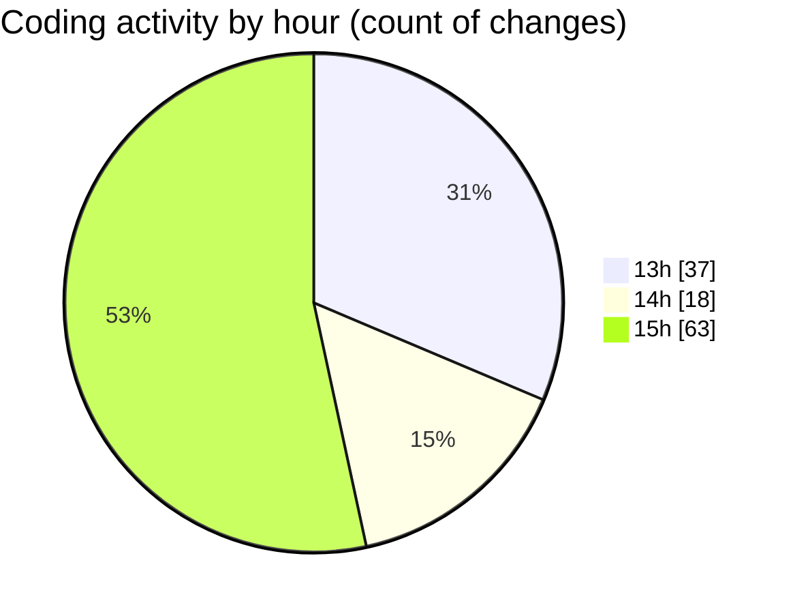

# Scripting workshop - Activity Summary 

## Overall Statistics

| Stat                   | Value                                                             |
| ---------------------- | ----------------------------------------------------------------- |
| **Lines Added** (➕)   | 7270                                          |
| **Lines Removed** (➖) | 364                                        |
| **Net Change** (↕)    | 6906                |
| **Active Time** (⌚)   | 142 minutes |

## Modified Files
- **automation_system.py** (+735, -0)
- **system_automation.sh** (+726, -358)
- **crontab_setup.txt** (+119, -0)
- **system_monitoring_output_day1.log** (+61, -0)
- **system_monitoring_output_day2.log** (+57, -0)
- **system_monitoring_output_day3.log** (+59, -0)
- **sample_report.json** (+149, -0)
- **CONSOLIDATED_3DAY_REPORT.txt** (+480, -0)
- **COMPLETION_SUMMARY.txt** (+436, -0)
- **system_monitoring_continuous.log** (+241, -0)
- **activity.log** (+272, -0)
- **CRONTAB_PROOF.txt** (+211, -0)
- **EXECUTION_EVIDENCE_REPORT.txt** (+346, -0)
- **FOR_EXAMINERS_READ_FIRST.txt** (+230, -0)
- **CRITICAL_FIXES_IMPLEMENTED.txt** (+304, -0)
- **SUBMISSION_READY_CHECKLIST.txt** (+269, -0)
- **COMMIT_EDITMSG** (+22, -6)
- **VERIFY_FIXES.sh** (+90, -0)
- **FINAL_ACTION_PLAN.txt** (+222, -0)
- **00_READ_ME_FIRST_TODAY.txt** (+233, -0)
- **BOTH_SCRIPTS_COMPLETE_VERIFIED.txt** (+278, -0)
- **FINAL_SUBMISSION_READINESS.txt** (+280, -0)
- **SETUP_CRON.sh** (+64, -0)
- **COLLECT_EVIDENCE.sh** (+73, -0)
- **SETUP_CRON.ps1** (+51, -0)
- **COLLECT_EVIDENCE.ps1** (+43, -0)
- **AUTOMATED_SOLUTION_HOW_TO.txt** (+191, -0)
- **settings.json** (+59, -0)
- **system_automation_20260411.log** (+241, -0)
- **system_monitoring_continuous.log** (+591, -0)
- **convert_to_pdf.py** (+137, -0)

## Visualizations

### By File Type (Lines Changed)

### By Hour (Estimated Activity Count)

> **Last Updated:** 4/11/2026, 3:44:43 PM