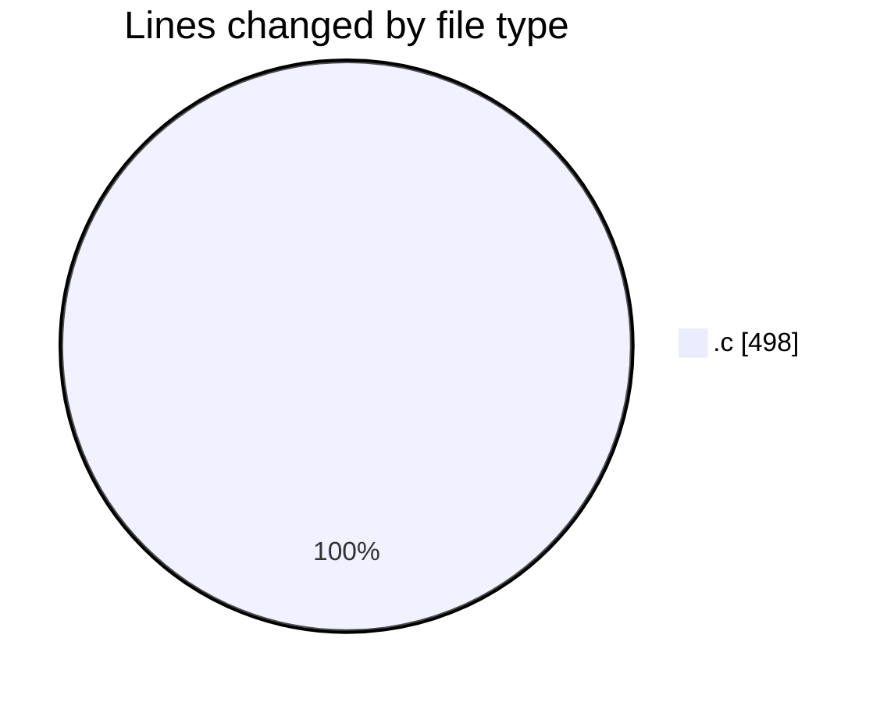
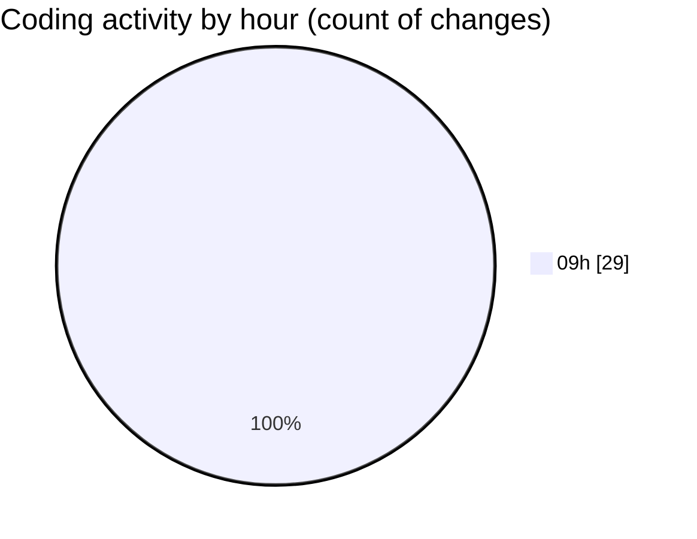

# Programming Workshop - Activity Summary 

## Overall Statistics

| Stat                   | Value                                                             |
| ---------------------- | ----------------------------------------------------------------- |
| **Lines Added** (➕)   | 492                                          |
| **Lines Removed** (➖) | 6                                        |
| **Net Change** (↕)    | 486                |
| **Active Time** (⌚)   | 28 minutes |

## Modified Files
- **frog.c** (+41, -0)
- **rainwater.c** (+51, -6)
- **min-platform02.c** (+65, -0)
- **travel.c** (+80, -0)
- **bt-zigzag01.c** (+112, -0)
- **Mergeover02.c** (+49, -0)
- **maxheap.c** (+94, -0)

## Visualizations

### By File Type (Lines Changed)

### By Hour (Estimated Activity Count)

> **Last Updated:** 4/23/2026, 9:54:53 AM