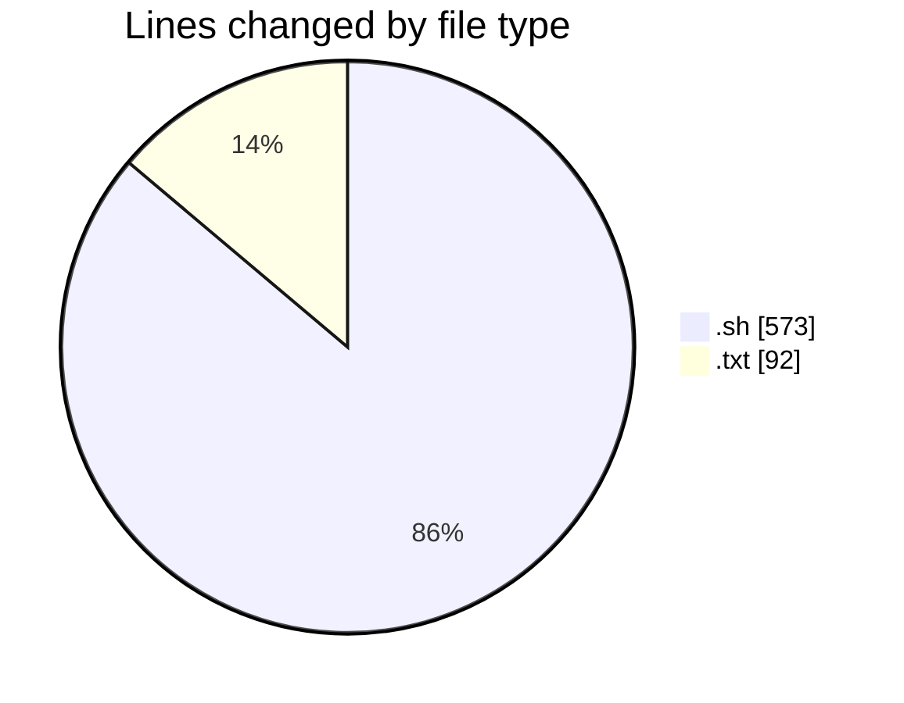
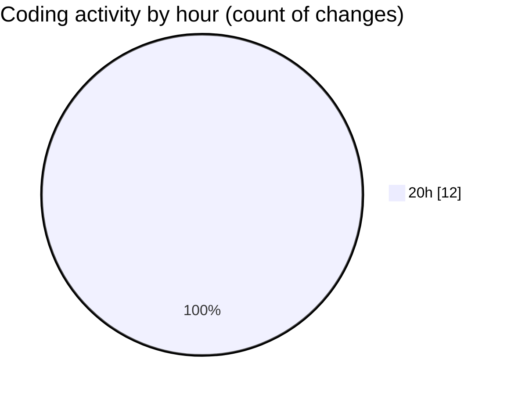

# Assignment-3 - Activity Summary 

## Overall Statistics

| Stat                   | Value                                                             |
| ---------------------- | ----------------------------------------------------------------- |
| **Lines Added** (➕)   | 665                                          |
| **Lines Removed** (➖) | 0                                        |
| **Net Change** (↕)    | 665                |
| **Active Time** (⌚)   | 11 minutes |

## Modified Files
- **01_top_20_hosts.sh** (+39, -0)
- **02_requests_per_day.sh** (+39, -0)
- **03_requests_per_hour.sh** (+39, -0)
- **04_most_requested_files.sh** (+40, -0)
- **05_status_code_percentage.sh** (+57, -0)
- **06_top_404_files.sh** (+42, -0)
- **07_average_bytes.sh** (+50, -0)
- **08_file_types.sh** (+47, -0)
- **09_busiest_time_window.sh** (+46, -0)
- **10_bot_crawlers.sh** (+82, -0)
- **run_all_analyses.sh** (+92, -0)
- **sample_nasa_logs.txt** (+92, -0)

## Visualizations

### By File Type (Lines Changed)

### By Hour (Estimated Activity Count)

> **Last Updated:** 5/5/2026, 8:12:41 PM