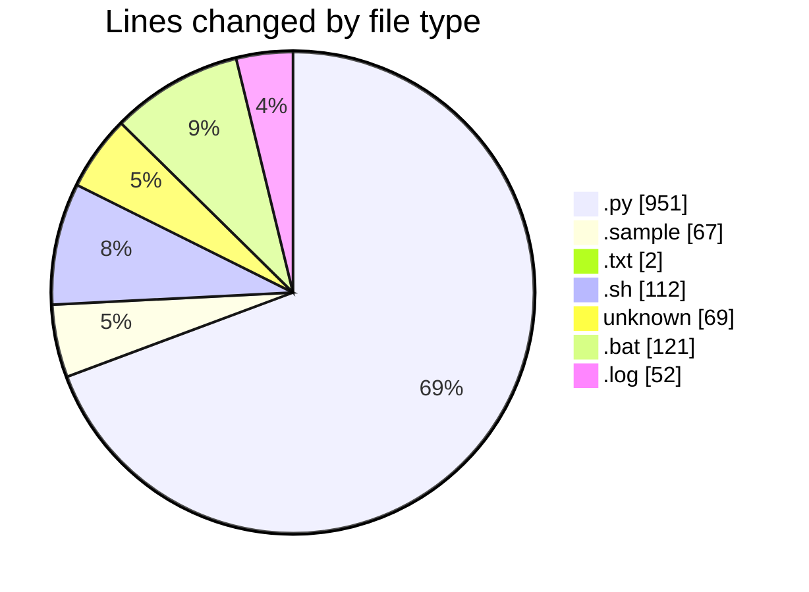
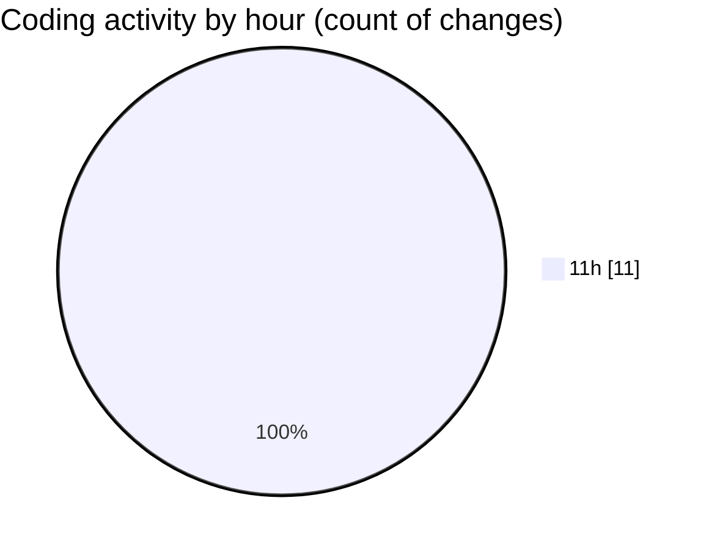

# Project - Activity Summary 

## Overall Statistics

| Stat                   | Value                                                             |
| ---------------------- | ----------------------------------------------------------------- |
| **Lines Added** (➕)   | 1374                                          |
| **Lines Removed** (➖) | 0                                        |
| **Net Change** (↕)    | 1374                |
| **Active Time** (⌚)   | 9 minutes |

## Modified Files
- **main.py** (+951, -0)
- **.env.sample** (+67, -0)
- **requirements.txt** (+2, -0)
- **run_cleanup.sh** (+54, -0)
- **run_backup.sh** (+58, -0)
- **.gitignore** (+69, -0)
- **run_cleanup.bat** (+53, -0)
- **run_backup.bat** (+68, -0)
- **db_ops.log** (+52, -0)

## Visualizations

### By File Type (Lines Changed)

### By Hour (Estimated Activity Count)

> **Last Updated:** 5/16/2026, 11:16:24 AM