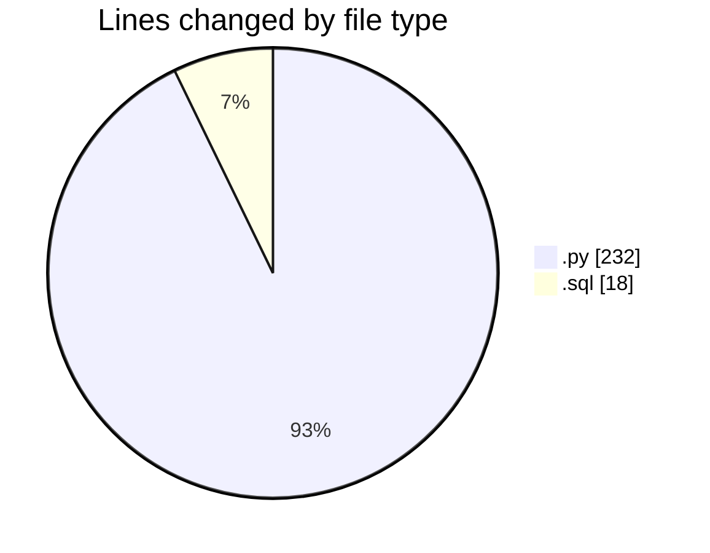
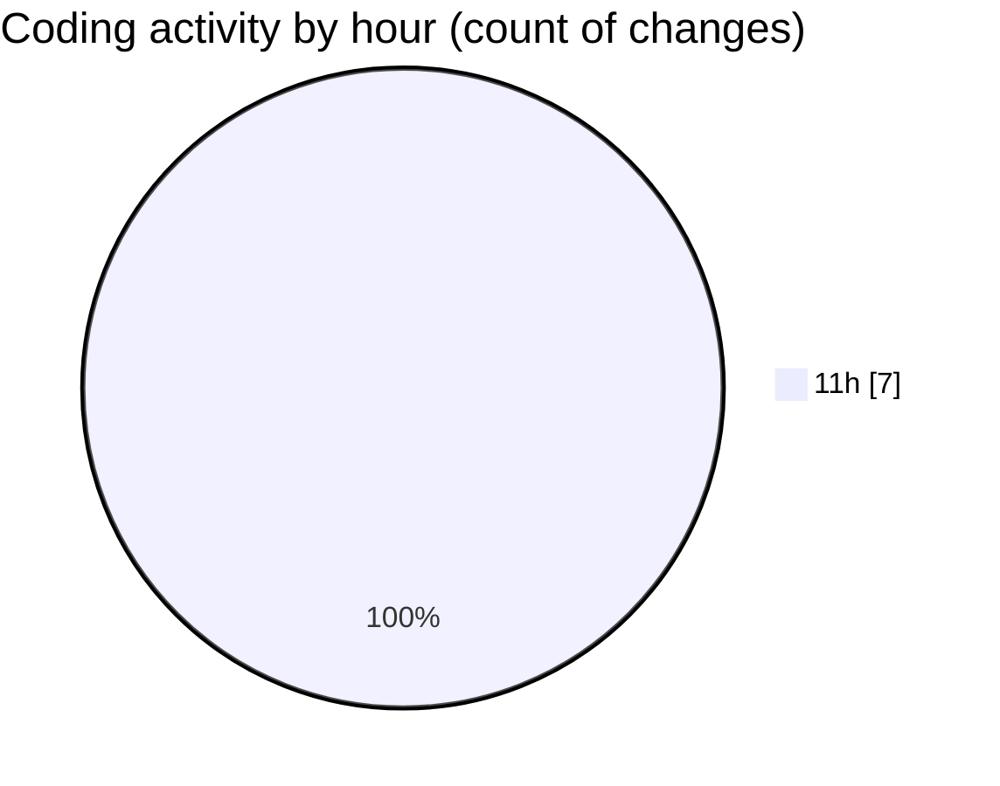

# SWS - Activity Summary 

## Overall Statistics

| Stat                   | Value                                                             |
| ---------------------- | ----------------------------------------------------------------- |
| **Lines Added** (➕)   | 250                                          |
| **Lines Removed** (➖) | 0                                        |
| **Net Change** (↕)    | 250                |
| **Active Time** (⌚)   | 4 minutes |

## Modified Files
- **backup.py** (+36, -0)
- **dbsetup.sql** (+18, -0)
- **migration.py** (+41, -0)
- **validation.py** (+48, -0)
- **menu.py** (+59, -0)
- **runall.py** (+48, -0)

## Visualizations

### By File Type (Lines Changed)

### By Hour (Estimated Activity Count)

> **Last Updated:** 5/16/2026, 11:05:45 AM