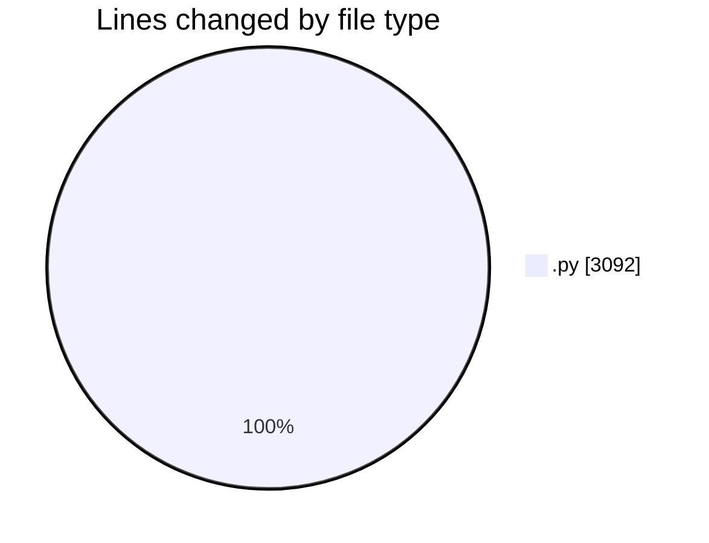
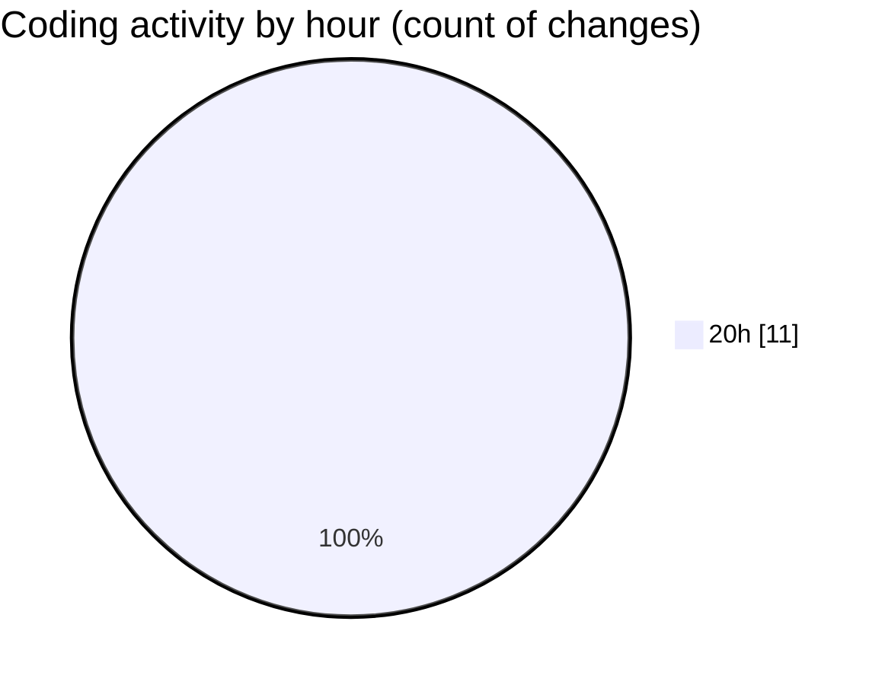

# ASSIGNMENT 3 - Activity Summary 

## Overall Statistics

| Stat                   | Value                                                             |
| ---------------------- | ----------------------------------------------------------------- |
| **Lines Added** (➕)   | 3092                                          |
| **Lines Removed** (➖) | 0                                        |
| **Net Change** (↕)    | 3092                |
| **Active Time** (⌚)   | 11 minutes |

## Modified Files
- **game.py** (+172, -0)
- **minimax.py** (+154, -0)
- **alpha_beta.py** (+180, -0)
- **heuristic_search.py** (+184, -0)
- **mcts.py** (+310, -0)
- **comparison.py** (+238, -0)
- **test_algorithms.py** (+378, -0)
- **knowledge_base.py** (+382, -0)
- **reasoning_engine.py** (+365, -0)
- **demo.py** (+331, -0)
- **test_planner.py** (+398, -0)

## Visualizations

### By File Type (Lines Changed)

### By Hour (Estimated Activity Count)

> **Last Updated:** 5/28/2026, 8:40:00 PM