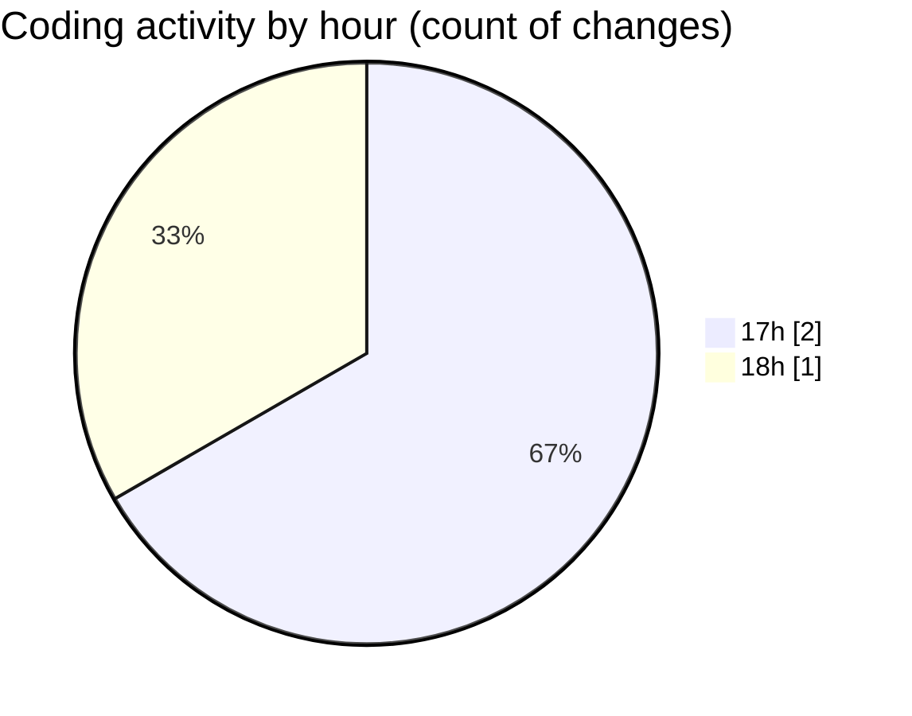

# ASSIGNMENT 3 - Activity Summary 

## Overall Statistics

| Stat                   | Value                                                             |
| ---------------------- | ----------------------------------------------------------------- |
| **Lines Added** (➕)   | 1215                                          |
| **Lines Removed** (➖) | 0                                        |
| **Net Change** (↕)    | 1215                |
| **Active Time** (⌚)   | 2 minutes |

## Modified Files
- **bayesian_network.py** (+437, -0)
- **disease_diagnosis.py** (+298, -0)
- **inference_engine.py** (+480, -0)

## Visualizations

### By File Type (Lines Changed)

### By Hour (Estimated Activity Count)

> **Last Updated:** 5/29/2026, 6:00:37 PM