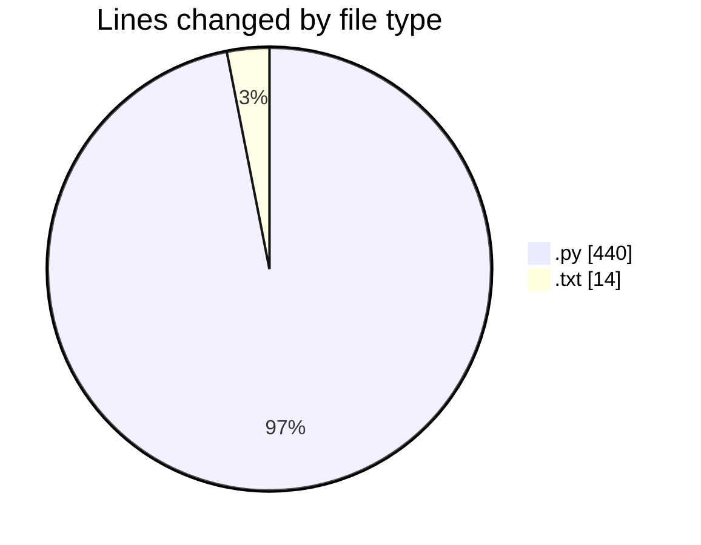
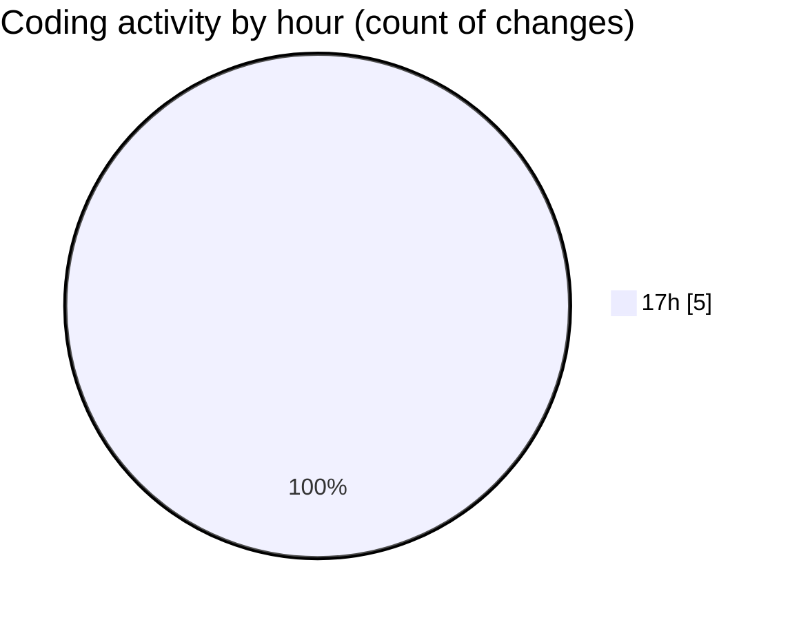

# researchlens - Activity Summary 

## Overall Statistics

| Stat                   | Value                                                             |
| ---------------------- | ----------------------------------------------------------------- |
| **Lines Added** (➕)   | 454                                          |
| **Lines Removed** (➖) | 0                                        |
| **Net Change** (↕)    | 454                |
| **Active Time** (⌚)   | 4 minutes |

## Modified Files
- **ingestion.py** (+197, -0)
- **chunking.py** (+83, -0)
- **retrieval.py** (+100, -0)
- **generation.py** (+60, -0)
- **requirements.txt** (+14, -0)

## Visualizations

### By File Type (Lines Changed)

### By Hour (Estimated Activity Count)

> **Last Updated:** 7/3/2026, 5:20:29 PM