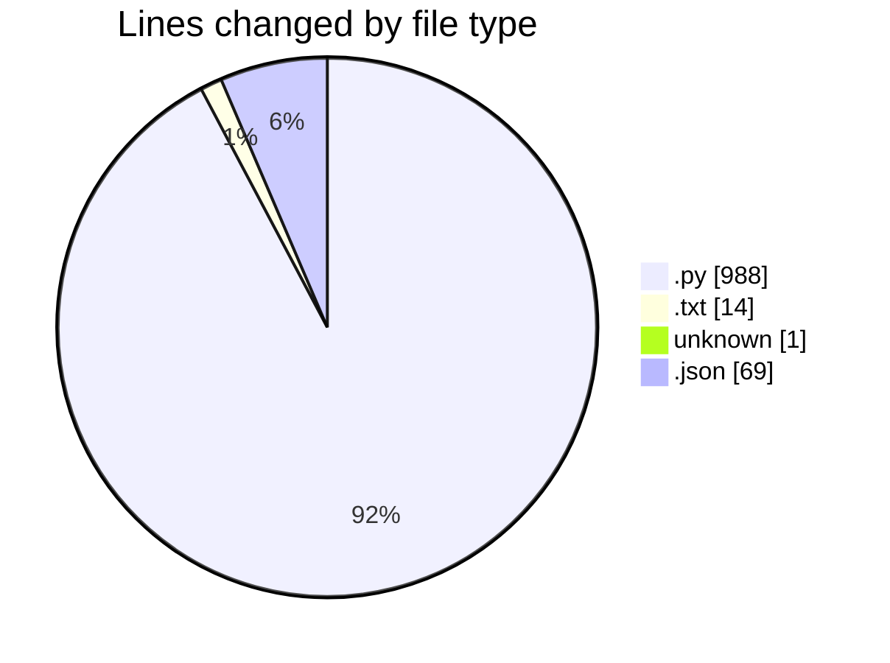
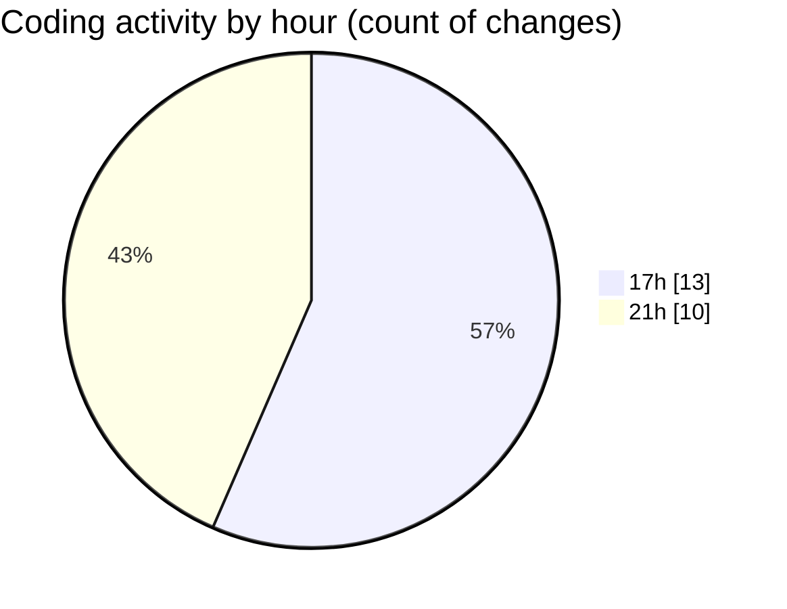

# researchlens - Activity Summary 

## Overall Statistics

| Stat                   | Value                                                             |
| ---------------------- | ----------------------------------------------------------------- |
| **Lines Added** (➕)   | 962                                          |
| **Lines Removed** (➖) | 110                                        |
| **Net Change** (↕)    | 852                |
| **Active Time** (⌚)   | 25 minutes |

## Modified Files
- **ingestion.py** (+203, -0)
- **chunking.py** (+83, -0)
- **retrieval.py** (+100, -0)
- **generation.py** (+60, -0)
- **requirements.txt** (+14, -0)
- **git-rebase-todo** (+1, -0)
- **__init__.py** (+8, -0)
- **ingestion.py** (+20, -0)
- **chunking.py** (+58, -39)
- **retrieval.py** (+55, -1)
- **generation.py** (+29, -0)
- **app.py** (+262, -70)
- **settings.json** (+69, -0)

## Visualizations

### By File Type (Lines Changed)

### By Hour (Estimated Activity Count)

> **Last Updated:** 7/3/2026, 9:30:35 PM