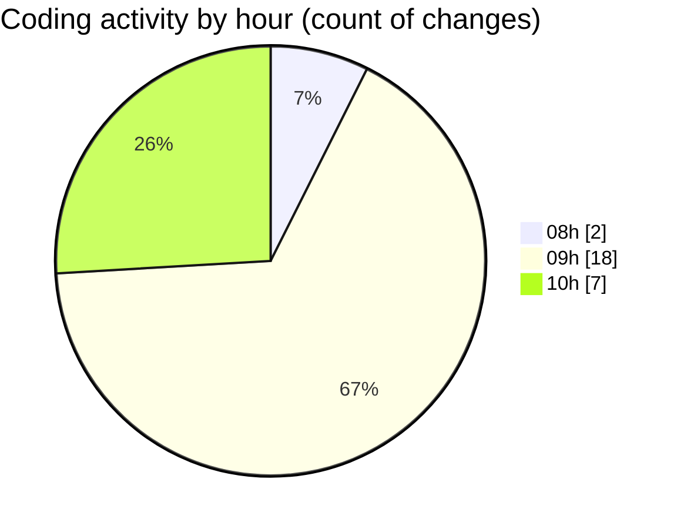

# LAB2 - Activity Summary 

## Overall Statistics

| Stat                   | Value                                                             |
| ---------------------- | ----------------------------------------------------------------- |
| **Lines Added** (➕)   | 351                                          |
| **Lines Removed** (➖) | 12                                        |
| **Net Change** (↕)    | 339                |
| **Active Time** (⌚)   | 30 minutes |

## Modified Files
- **first.html** (+26, -0)
- **second.html** (+17, -0)
- **third.html** (+21, -0)
- **frame2.html** (+11, -0)
- **frame1.html** (+67, -11)
- **task1.html** (+73, -1)
- **frame1_update.html** (+21, -0)
- **grocery.html** (+81, -0)
- **categories.html** (+17, -0)
- **fruits.html** (+17, -0)

## Visualizations

### By File Type (Lines Changed)

### By Hour (Estimated Activity Count)

> **Last Updated:** 8/20/2026, 10:10:20 AM