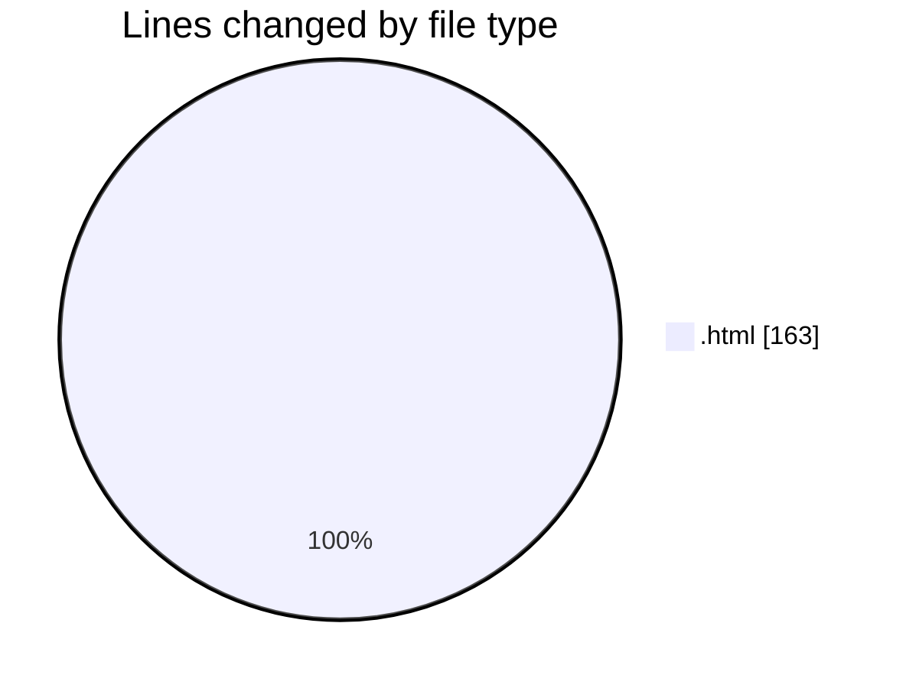
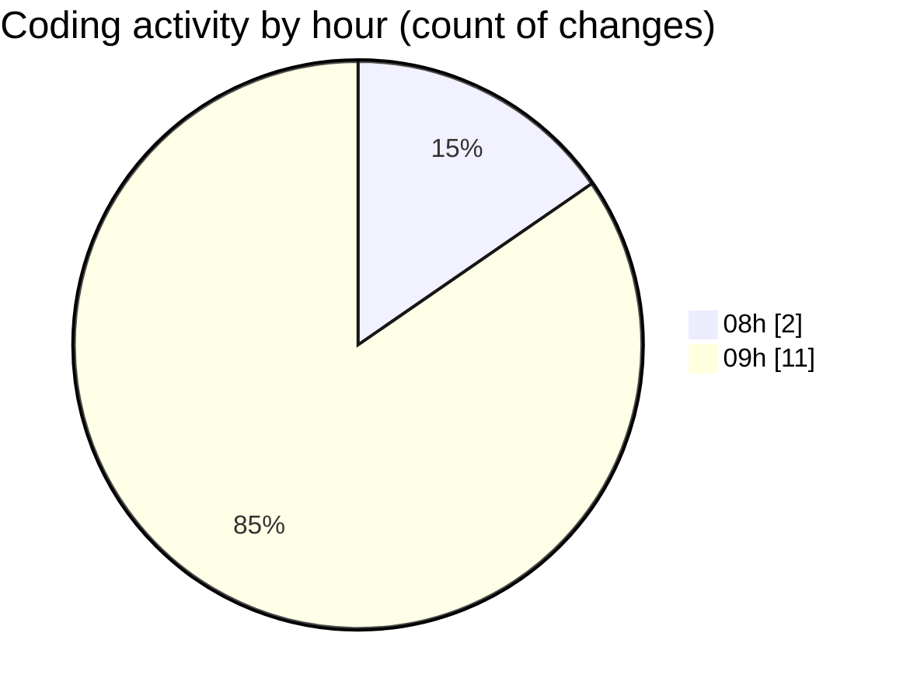

# LAB2 - Activity Summary 

## Overall Statistics

| Stat                   | Value                                                             |
| ---------------------- | ----------------------------------------------------------------- |
| **Lines Added** (➕)   | 161                                          |
| **Lines Removed** (➖) | 2                                        |
| **Net Change** (↕)    | 159                |
| **Active Time** (⌚)   | 15 minutes |

## Modified Files
- **first.html** (+26, -0)
- **second.html** (+17, -0)
- **third.html** (+21, -0)
- **frame2.html** (+11, -0)
- **frame1.html** (+13, -1)
- **task1.html** (+73, -1)

## Visualizations

### By File Type (Lines Changed)

### By Hour (Estimated Activity Count)

> **Last Updated:** 8/20/2026, 9:28:28 AM