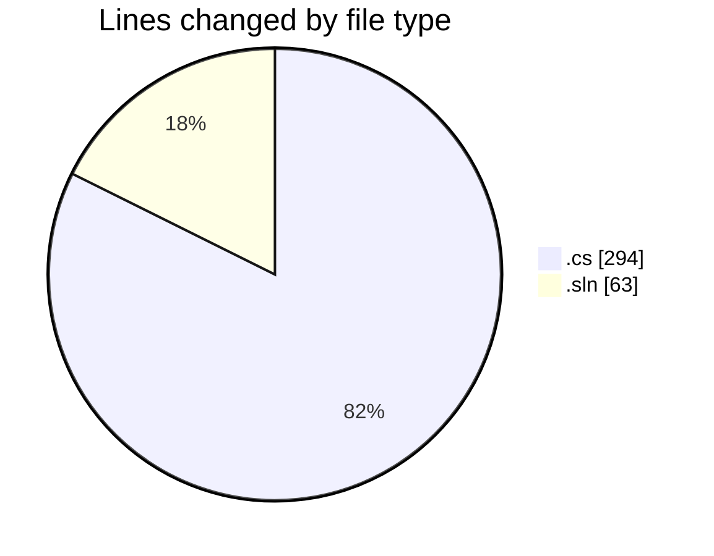
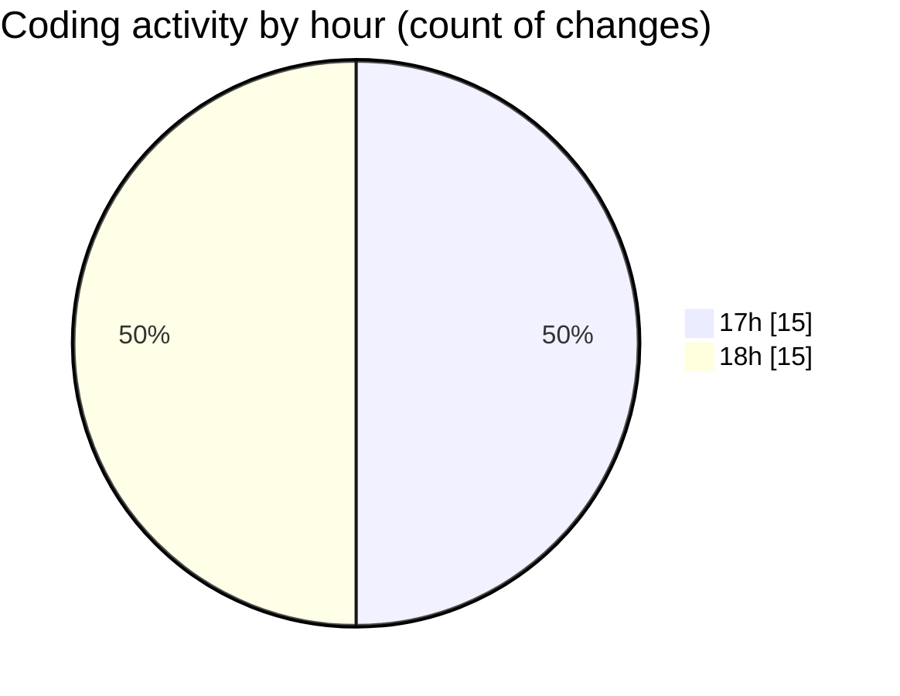

# Immersive_CODES - Activity Summary 

## Overall Statistics

| Stat                   | Value                                                             |
| ---------------------- | ----------------------------------------------------------------- |
| **Lines Added** (➕)   | 277                                          |
| **Lines Removed** (➖) | 80                                        |
| **Net Change** (↕)    | 197                |
| **Active Time** (⌚)   | 46 minutes |

## Modified Files
- **Program.cs** (+37, -1)
- **tryibg.cs** (+44, -43)
- **Program.cs** (+36, -0)
- **Program.cs** (+36, -0)
- **Programs.cs** (+48, -35)
- **firstC#Code.sln** (+63, -0)
- **Program.cs** (+13, -1)

## Visualizations

### By File Type (Lines Changed)

### By Hour (Estimated Activity Count)

> **Last Updated:** 8/27/2026, 6:21:49 PM