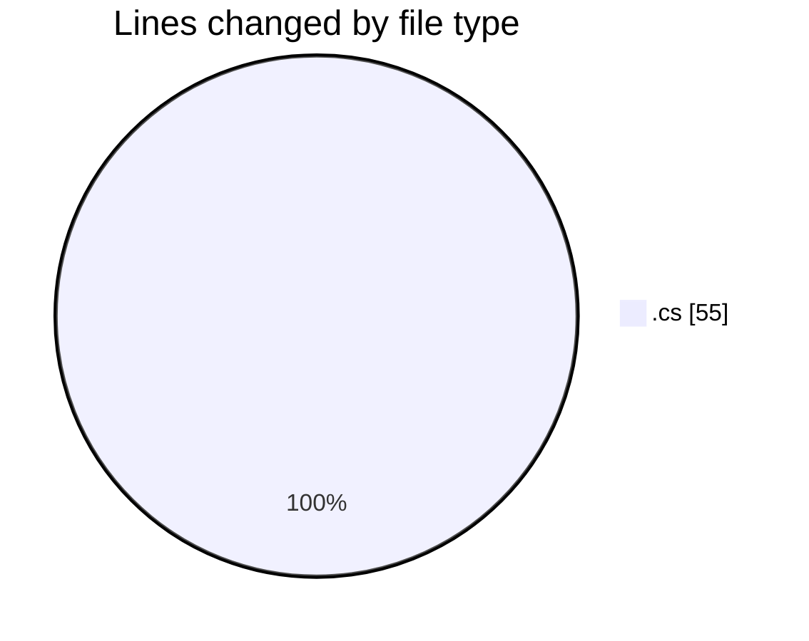
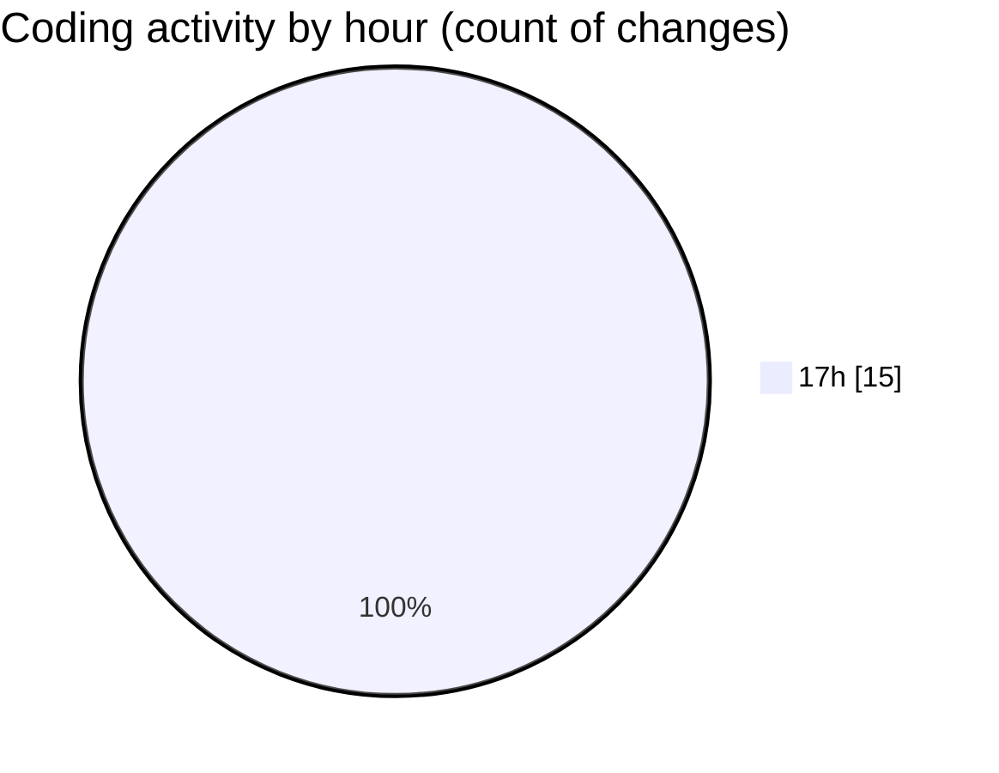

# Immersive_CODES - Activity Summary 

## Overall Statistics

| Stat                   | Value                                                             |
| ---------------------- | ----------------------------------------------------------------- |
| **Lines Added** (➕)   | 46                                          |
| **Lines Removed** (➖) | 9                                        |
| **Net Change** (↕)    | 37                |
| **Active Time** (⌚)   | 21 minutes |

## Modified Files
- **Program.cs** (+37, -1)
- **tryibg.cs** (+9, -8)

## Visualizations

### By File Type (Lines Changed)

### By Hour (Estimated Activity Count)

> **Last Updated:** 8/27/2026, 5:56:47 PM