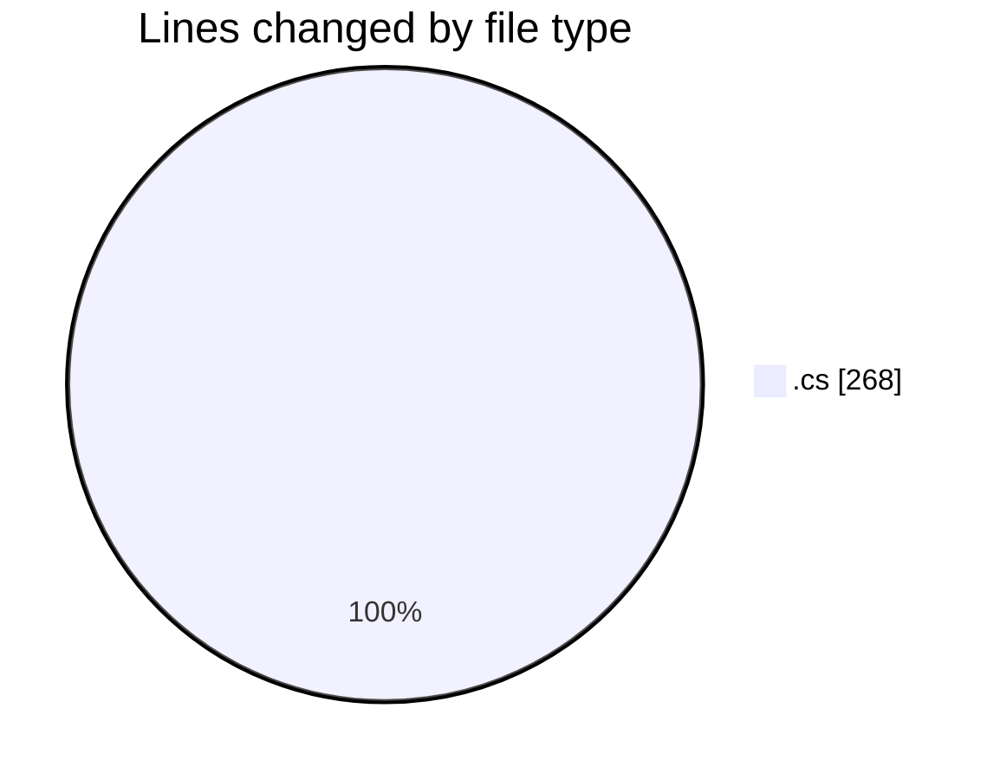
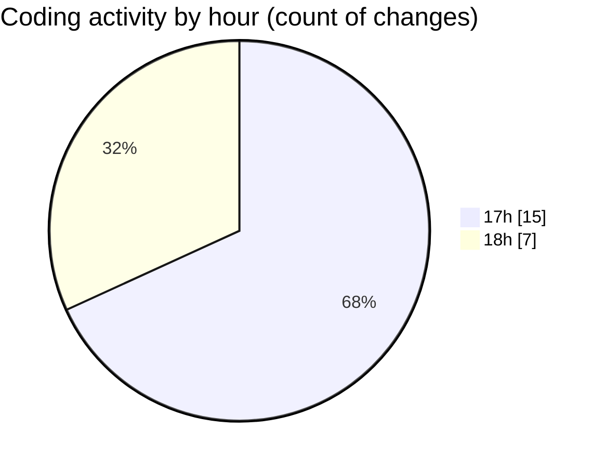

# Immersive_CODES - Activity Summary 

## Overall Statistics

| Stat                   | Value                                                             |
| ---------------------- | ----------------------------------------------------------------- |
| **Lines Added** (➕)   | 189                                          |
| **Lines Removed** (➖) | 79                                        |
| **Net Change** (↕)    | 110                |
| **Active Time** (⌚)   | 37 minutes |

## Modified Files
- **Program.cs** (+37, -1)
- **tryibg.cs** (+44, -43)
- **Program.cs** (+36, -0)
- **Program.cs** (+36, -0)
- **Programs.cs** (+36, -35)

## Visualizations

### By File Type (Lines Changed)

### By Hour (Estimated Activity Count)

> **Last Updated:** 8/27/2026, 6:16:48 PM