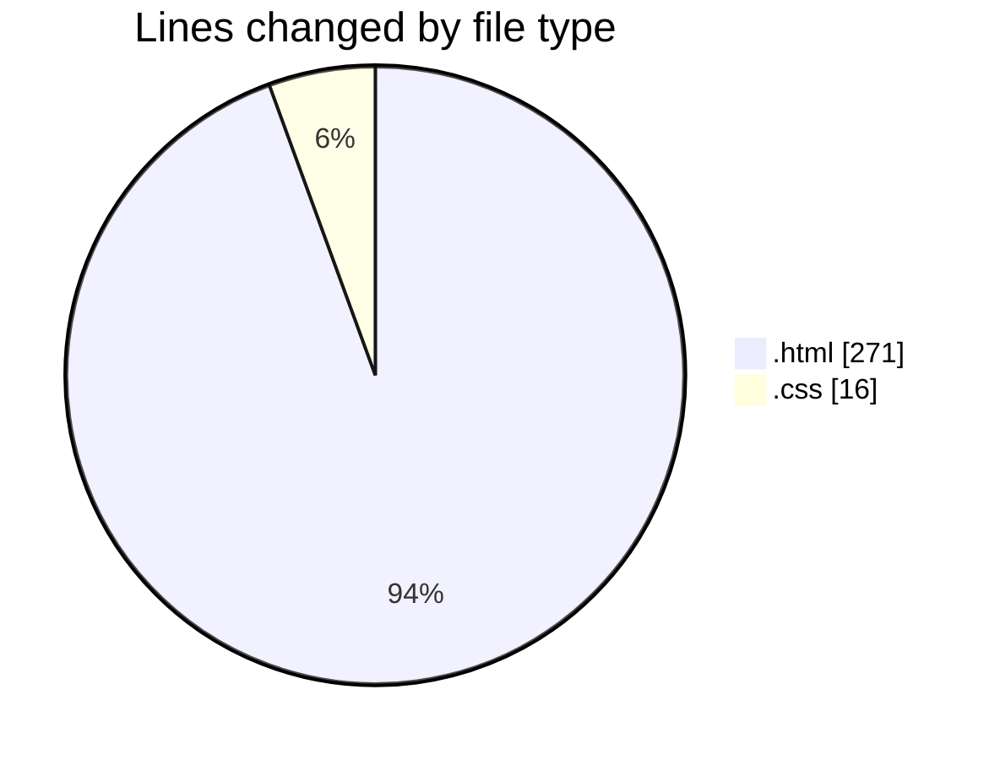
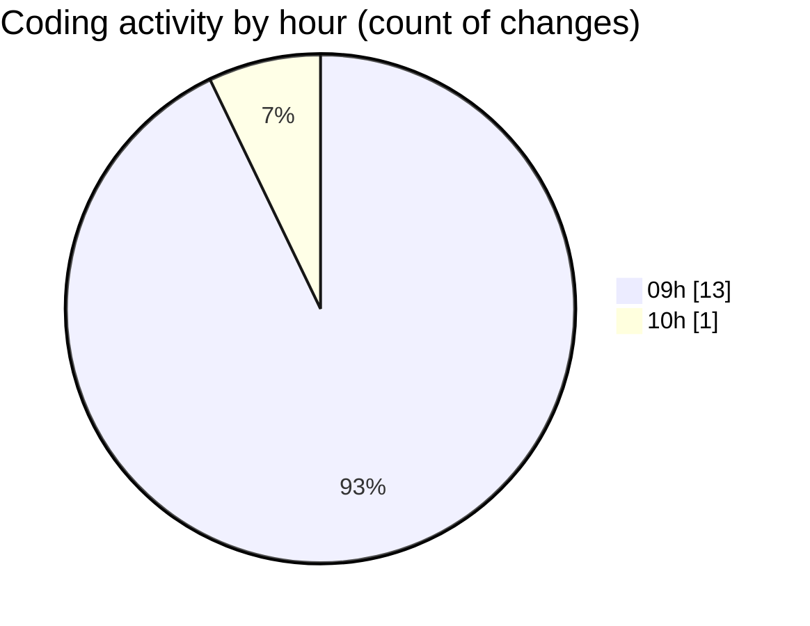

# WEB_TEC_2026 - Activity Summary 

## Overall Statistics

| Stat                   | Value                                                             |
| ---------------------- | ----------------------------------------------------------------- |
| **Lines Added** (➕)   | 287                                          |
| **Lines Removed** (➖) | 0                                        |
| **Net Change** (↕)    | 287                |
| **Active Time** (⌚)   | 14 minutes |

## Modified Files
- **frame2.html** (+11, -0)
- **navigationbar.html** (+46, -0)
- **cart_loadout.html** (+64, -0)
- **blockvs_inline.html** (+44, -0)
- **trying_integrated_css.html** (+12, -0)
- **mystyle.css** (+16, -0)
- **grid_layout.html** (+43, -0)
- **Amazon.html** (+51, -0)

## Visualizations

### By File Type (Lines Changed)

### By Hour (Estimated Activity Count)

> **Last Updated:** 8/27/2026, 10:09:16 AM