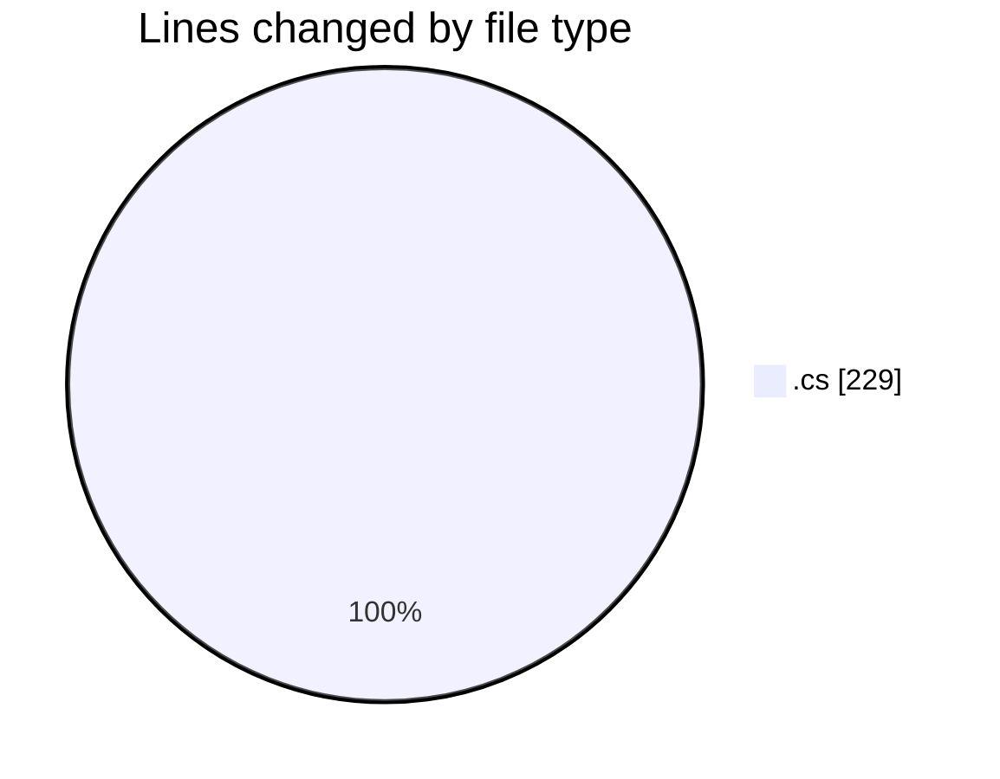
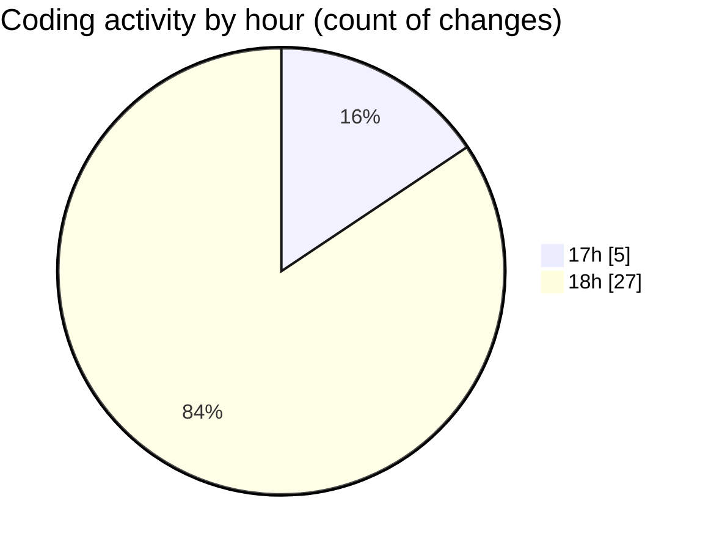

# Immersive_CODES - Activity Summary 

## Overall Statistics

| Stat                   | Value                                                             |
| ---------------------- | ----------------------------------------------------------------- |
| **Lines Added** (➕)   | 149                                          |
| **Lines Removed** (➖) | 80                                        |
| **Net Change** (↕)    | 69                |
| **Active Time** (⌚)   | 32 minutes |

## Modified Files
- **Program.cs** (+134, -79)
- **Person.cs** (+15, -1)

## Visualizations

### By File Type (Lines Changed)

### By Hour (Estimated Activity Count)

> **Last Updated:** 9/1/2026, 6:27:56 PM