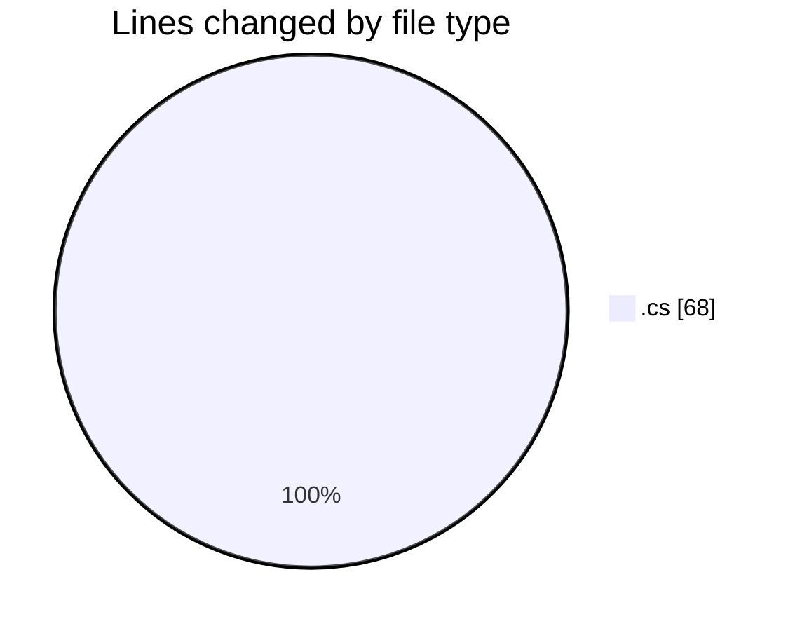
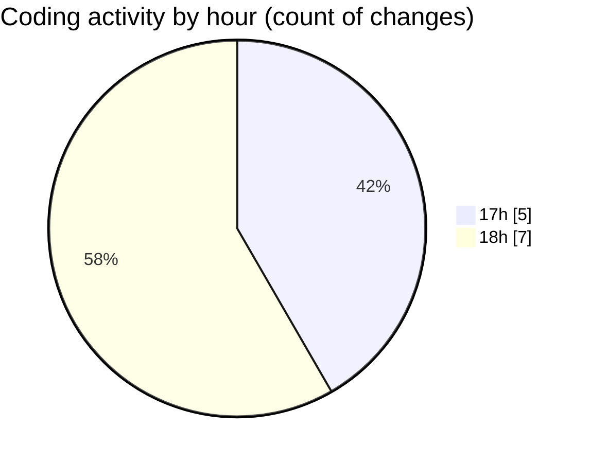

# Immersive_CODES - Activity Summary 

## Overall Statistics

| Stat                   | Value                                                             |
| ---------------------- | ----------------------------------------------------------------- |
| **Lines Added** (➕)   | 50                                          |
| **Lines Removed** (➖) | 18                                        |
| **Net Change** (↕)    | 32                |
| **Active Time** (⌚)   | 10 minutes |

## Modified Files
- **Program.cs** (+50, -18)

## Visualizations

### By File Type (Lines Changed)

### By Hour (Estimated Activity Count)

> **Last Updated:** 9/1/2026, 6:11:18 PM