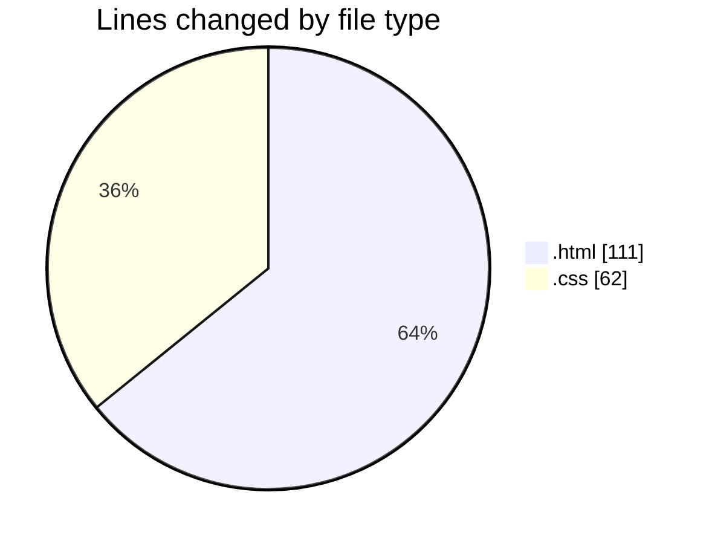
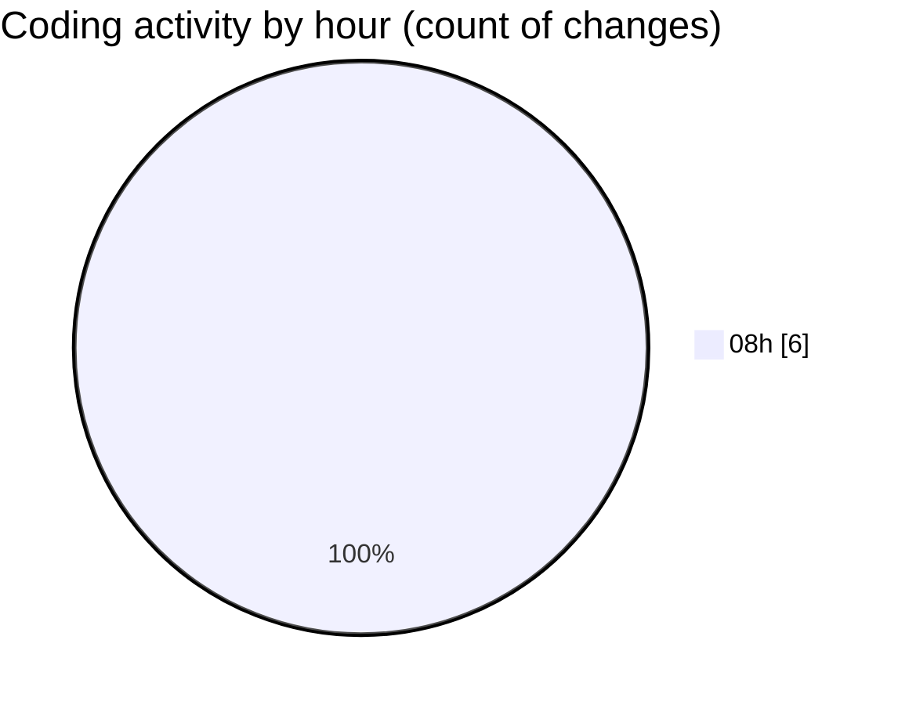

# WEB_TEC_2026 - Activity Summary 

## Overall Statistics

| Stat                   | Value                                                             |
| ---------------------- | ----------------------------------------------------------------- |
| **Lines Added** (➕)   | 173                                          |
| **Lines Removed** (➖) | 0                                        |
| **Net Change** (↕)    | 173                |
| **Active Time** (⌚)   | 0 minute |

## Modified Files
- **zomato-header.html** (+27, -0)
- **zomato.html** (+21, -0)
- **zomato.css** (+62, -0)
- **zomato-menu.html** (+27, -0)
- **zomato-order.html** (+36, -0)

## Visualizations

### By File Type (Lines Changed)

### By Hour (Estimated Activity Count)

> **Last Updated:** 9/1/2026, 8:50:04 AM