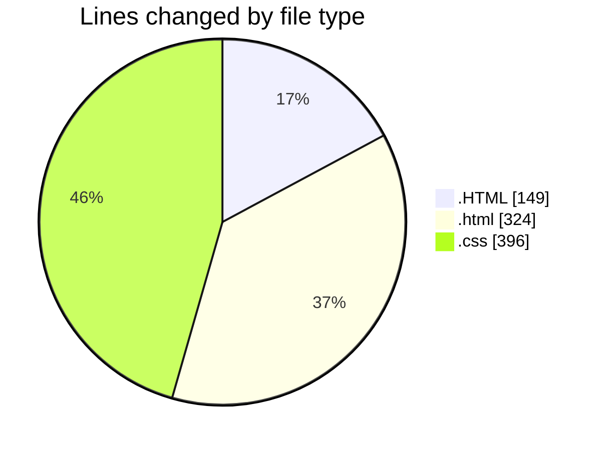
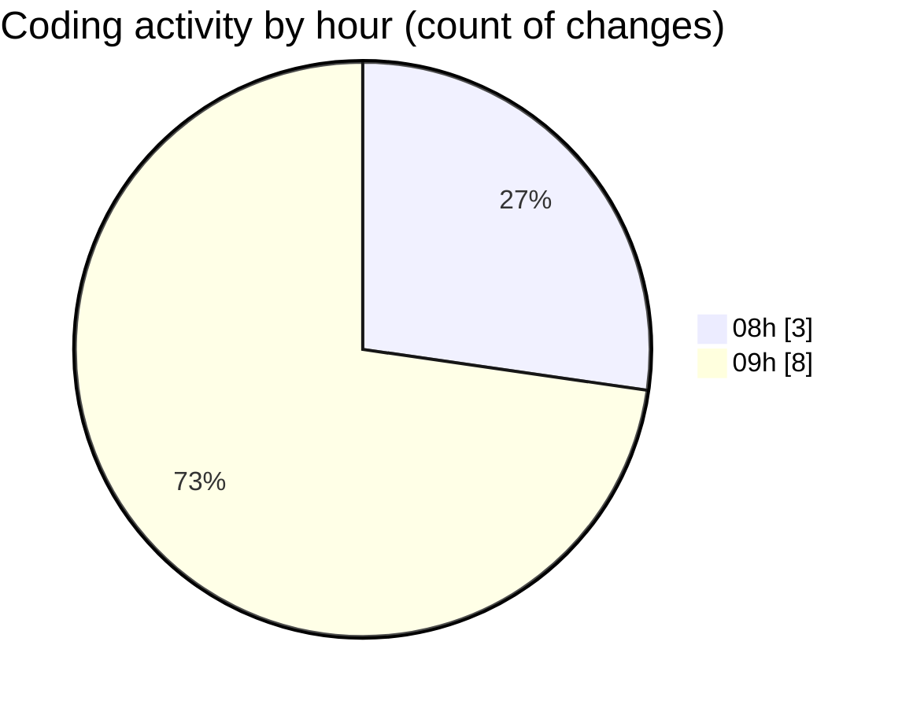

# WEB_TEC_2026 - Activity Summary 

## Overall Statistics

| Stat                   | Value                                                             |
| ---------------------- | ----------------------------------------------------------------- |
| **Lines Added** (➕)   | 869                                          |
| **Lines Removed** (➖) | 0                                        |
| **Net Change** (↕)    | 869                |
| **Active Time** (⌚)   | 9 minutes |

## Modified Files
- **RWD2.HTML** (+49, -0)
- **RWD4.HTML** (+61, -0)
- **RWD5.HTML** (+39, -0)
- **index.html** (+160, -0)
- **style.css** (+396, -0)
- **index.html** (+164, -0)

## Visualizations

### By File Type (Lines Changed)

### By Hour (Estimated Activity Count)

> **Last Updated:** 9/3/2026, 9:21:55 AM