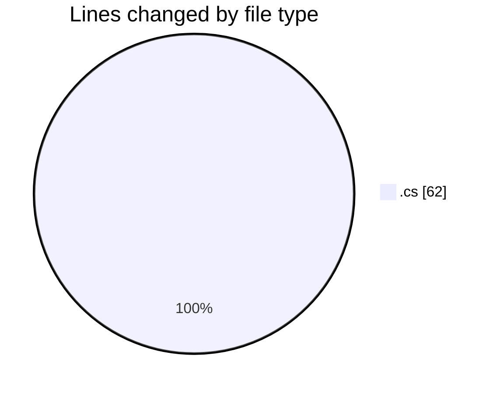
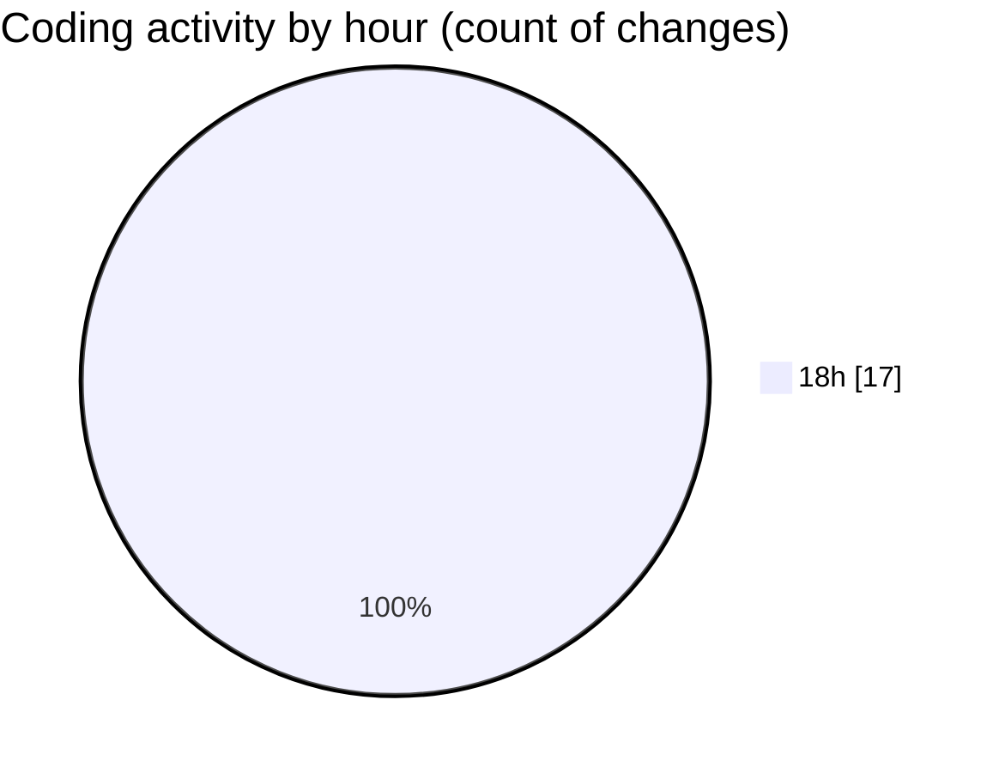

# Immersive_CODES - Activity Summary 

## Overall Statistics

| Stat                   | Value                                                             |
| ---------------------- | ----------------------------------------------------------------- |
| **Lines Added** (➕)   | 57                                          |
| **Lines Removed** (➖) | 5                                        |
| **Net Change** (↕)    | 52                |
| **Active Time** (⌚)   | 19 minutes |

## Modified Files
- **Program.cs** (+30, -4)
- **2ndprogram.cs** (+27, -1)

## Visualizations

### By File Type (Lines Changed)

### By Hour (Estimated Activity Count)

> **Last Updated:** 9/7/2026, 6:26:43 PM